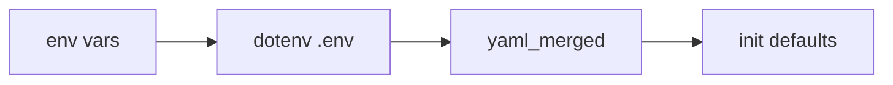

# DEV-002 配置系统与 `.env.example`

## 1. 任务信息

```yaml
task_id: DEV-002
task_name: 配置系统与 .env.example
status: committed
spec_sections:
  - "§1.2.6 Context Compression Trigger Strategy（context YAML 与跨字段校验）"
  - "§2.1.4 / §2.1.6 memory_extraction YAML"
  - "§2.2.14 memory_retrieval YAML 与权重校验"
  - "§2.3.12 memory_consolidation YAML 与权重校验"
  - "§3.4 单仓库目录结构（configs/、.env.example、check_env_example.py）"
  - "§3.7 Web 服务与应用生命周期（Lifespan 加载配置）"
  - "§3.8 配置管理（优先级、loader、Secret 规则）"
  - "§3.9 DeepSeek LLM 接入方式（llm YAML + LLM__* 环境变量）"
  - "§3.10 本地 Embedding 部署方式（embedding YAML + EMBEDDING__* 环境变量）"
  - "§3.19 Kafka Topic 与客户端参数"
  - "§3.21 Memory API 鉴权（MEMORY_*_API_KEY）"
  - "§3.24 连接池、超时与重试"
  - "§3.25 优雅关闭（shutdown YAML 与 compression_lock_ttl 关系）"
  - "§3.30 P1（.env.example 完整性 + check_env_example.py）"
prerequisites:
  - "DEV-001 completed（pyproject.toml 已含 pydantic-settings、pyyaml；settings/__init__.py 占位存在）"
  - "实施编码前须 PLAN_APPROVED；PRE-ENV-001/002 已 satisfied"
branch: "feat/DEV-002-config-system-env-example"
created_at: "2026-08-07 07:32 UTC"
updated_at: "2026-08-07 08:03 UTC"
approval_gates:
  planning_docs: "Round 2 复审通过；PLAN_APPROVED（BLOCKER 0 / MUST_FIX 0 / SHOULD_FIX 2 非阻塞）；人工确认 PLAN_APPROVED（2026-08-07 08:03 UTC）"
  implementation_plan: "status=tested；plan_commit=ceff988；分支 feat/DEV-002-config-system-env-example；Developer 实施完成，质量门禁通过，待 Code Review"
human_scope_confirmations:
  - "APP_ENV 仅支持 development / test；不提供 production.yaml；人工确认可接受，非阻塞"
```

## 2. 任务目标

本任务交付**统一、可校验、可测试**的配置子系统，使后续 DEV-003+ 任务仅通过 Settings Model 读取配置，不得在业务模块散落 `os.getenv()` 或重复读 YAML。

完成后应具备：

1. **Pydantic Settings + YAML Loader**：优先级固定为 `环境变量 > configs/{APP_ENV}.yaml > configs/base.yaml > Model 默认值`；`settings/loader.py` 使用 `yaml.safe_load`；通过 `settings_customise_sources` 保证 env 高于 YAML（pydantic-settings 2.14：**tuple 中先列出的 Source 优先级更高**；见 Amendment 002）。
2. **三份 YAML 配置文件**：`configs/base.yaml`（含规格全部业务阈值命名空间默认值）、`configs/development.yaml`、`configs/test.yaml`（仅环境覆盖；**不得**含 Secret）。
3. **完整 `.env.example`**：覆盖 §3.8 / §3.21 / §3.30 P1 要求的全部必需环境变量；仅非敏感示例值。
4. **`scripts/check_env_example.py`**：CI 可调用；断言 Settings 声明的全部必需 env 键均出现在 `.env.example`，且示例文件不含真实 Secret。
5. **跨字段校验**：实现 §1.2.6 `context`、§2.3.12 `memory_consolidation`、§2.2.14 `memory_retrieval`、§3.25 `shutdown` 与 `context.compression_lock_ttl_seconds` 关系等规格约束；非法配置在 `get_settings()` 时失败。
6. **SecretStr**：`LLM__API_KEY`、`MEMORY_API_KEY`、`MEMORY_ADMIN_API_KEY` 及连接串类 Secret 字段使用 `SecretStr`；YAML 中禁止出现 API Key / 密码。

## 3. 非目标

- Docker Compose、`Dockerfile`、`versions.env`、`versions.lock.env`、`compose*.yaml`（**DEV-003**）。
- Preflight、`scripts/compose.sh`、`scripts/start_embedding.sh`、`scripts/lock_tei_images.sh`（**DEV-003**）。
- Migration Runner 与 `001`–`004` 迁移（**DEV-004**）。
- FastAPI 应用壳、`api/dependencies.py`、`middleware.py`、`error_handlers.py`、鉴权接线（**DEV-005**）。
- 真实 Redis/MongoDB/Kafka/Neo4j/Elasticsearch/TEI/DeepSeek 客户端连接与 Lifespan 资源创建（本任务仅配置加载与校验）。
- 修改三 Entrypoint 为“可启动服务”；保持 DEV-001 未就绪语义，最多允许 `import memory_system.settings` 与单元/契约测试调用 `get_settings()`。
- 新增 §3.5 以外运行时依赖；修改 `pyproject.toml` 依赖版本（除非 Plan Review 发现缺漏且属规格既有依赖）。
- `uv.lock` 变更（本任务不新增依赖）。
- OpenTelemetry、真实 CI workflow 文件（**OPS-004**）；本任务仅交付 `check_env_example.py` 供后续 CI 调用。

## 4. 当前代码状态

- **已存在代码**：DEV-001 白名单包骨架；`src/memory_system/settings/__init__.py` 为空占位；`pydantic-settings>=2.14,<2.15` 与 `pyyaml>=6.0,<7` 已在 `pyproject.toml`。
- **可复用组件**：DEV-001 测试与质量工具配置；`tests/conftest.py`（**本任务禁止修改**，见 Amendment 001 SF-005）。
- **当前缺失**：`settings/loader.py`、`settings/models.py`、`settings/sources.py`、`settings/validators.py`；`configs/` 目录；`.env.example`；`scripts/check_env_example.py`；配置相关测试。
- **与技术规格不一致之处**：§3.4 要求的 `configs/`、`.env.example`、`check_env_example.py` 尚未创建；§3.8 统一配置入口未实现。
- **前置任务检查**：DEV-001 `completed`；`main` @ `f4fab24`，工作区干净；PRE-ENV-001/002 satisfied。

## 5. 文件白名单（本任务允许创建/修改的全部路径）

禁止使用 `src/memory_system/settings/**`、`configs/**`、`tests/**` 通配作为变更描述。实施时**仅允许**触及下列路径：

### 5.1 配置实现（`src/memory_system/settings/`）

| 路径 | 创建/修改 | 说明 |
|---|---|---|
| `src/memory_system/settings/__init__.py` | 修改 | 导出 `Settings`、`get_settings()`；模块级不触发网络 I/O |
| `src/memory_system/settings/loader.py` | 创建 | `yaml.safe_load` 读取 `base.yaml` + `{APP_ENV}.yaml`；递归 dict merge；根节点非 Mapping 时失败 |
| `src/memory_system/settings/sources.py` | 创建 | 自定义 Pydantic Settings Source（合并后 YAML dict） |
| `src/memory_system/settings/models.py` | 创建 | 嵌套 Pydantic Model；`model_config` + `settings_customise_sources`；`SecretStr` 字段 |
| `src/memory_system/settings/validators.py` | 创建 | 跨命名空间 `@model_validator` / 专用校验函数（context、consolidation、retrieval、shutdown） |

### 5.2 YAML 与 env 示例（仓库根）

| 路径 | 创建/修改 | 说明 |
|---|---|---|
| `configs/base.yaml` | 创建 | 全部 YAML 命名空间默认值（见 §5.4）；无 Secret |
| `configs/development.yaml` | 创建 | 开发环境覆盖（可为空 mapping 或最小差异） |
| `configs/test.yaml` | 创建 | 测试环境覆盖（供 pytest 使用；可为最小差异） |
| `.env.example` | 创建 | 全部必需 env 键 + 非敏感示例值（见 §5.3） |

### 5.3 脚本

| 路径 | 创建/修改 | 说明 |
|---|---|---|
| `scripts/check_env_example.py` | 创建 | 可 `python scripts/check_env_example.py` 或 `uv run python scripts/check_env_example.py`；退出码非零表示失败 |

### 5.4 测试

| 路径 | 创建/修改 | 说明 |
|---|---|---|
| `tests/unit/test_settings_loader.py` | 创建 | 优先级、非法 YAML、空文件、根节点类型；**本文件内**定义 `get_settings` 缓存 reset fixture |
| `tests/unit/test_settings_validation.py` | 创建 | 跨字段校验（context / consolidation / retrieval / shutdown）；**本文件内**定义所需 fixture |
| `tests/contract/test_env_example_contract.py` | 创建 | `.env.example` 键完整性与无 Secret |

**Amendment 001 决策（SF-005）**：`tests/conftest.py` **不在白名单**、**禁止修改**。Settings 缓存隔离 fixture 在各新建测试文件内局部定义（如 `@pytest.fixture(autouse=True)` 调用 `get_settings.cache_clear()`）；不得改动 DEV-001 既有空 `conftest.py`。

### 5.5 治理文档（本规划轮次已由 Planner 更新；实施阶段 Developer 可回写执行记录）

| 路径 | 说明 |
|---|---|
| `02_开发管理/tasks/DEV-002-config-system-env-example.md` | 本 Task Plan |
| `02_开发管理/progress.md` | 规划态 / 实施态字段 |
| `02_开发管理/master_plan.md` | DEV-002 登记 |

## 6. 文件黑名单（禁止本任务创建或修改）

| 路径 / 模式 | 归属 |
|---|---|
| `Dockerfile`、`compose.yaml`、`compose.override.yaml`、`compose.embedding.cpu.yaml`、`compose.embedding.gpu.yaml`、`compose.test.yaml` | DEV-003 |
| `versions.env`、`versions.lock.env` | DEV-003 |
| `scripts/compose.sh`、`scripts/start_embedding.sh`、`scripts/lock_tei_images.sh` | DEV-003 |
| `scripts/preflight/check_linux_host.sh` | DEV-003 |
| `scripts/migrate.py`、`scripts/migrations/001_initial_mongodb.py`–`004_initial_kafka_topics.py` | DEV-004 |
| `src/memory_system/api/dependencies.py`、`middleware.py`、`error_handlers.py` | DEV-005 |
| `src/memory_system/api/routes/` 下除既有 `__init__.py` 外的业务路由 | DEV-005+ |
| `src/memory_system/infrastructure/**` 下具体 Client 实现 | DEV-003–DEV-006 及后续 |
| `src/memory_system/entrypoints/api.py` 等三入口的业务启动逻辑（除 import 兼容性外不得改为“假成功启动”） | DEV-005 / 后续 |
| `scripts/republish_archive_event.py` | STM-011 |
| `.env`（真实 Secret 文件） | 永不提交 |
| `tests/conftest.py` | DEV-001 占位；本任务禁止修改（SF-005） |
| `pyproject.toml` / `uv.lock` 依赖变更 | 非本任务范围（除非审查发现缺漏） |
| `.github/workflows/**` | OPS-004 |

## 7. 环境变量与 YAML 命名空间映射（规格对齐）

### 7.1 必需环境变量（须出现在 `.env.example` 且被 `check_env_example.py` 校验）

| 环境变量 | 规格依据 | Settings 字段类型 | 示例值（非敏感） |
|---|---|---|---|
| `APP_ENV` | §3.8 | `Literal["development","test"]`（MVP 两环境 YAML） | `development` |
| `REDIS__URI` | §3.8、§3.2 | `SecretStr` 或含凭证的 URI 字段 | `redis://redis:6379/0` |
| `MONGODB__URI` | §3.8、§3.20 | `SecretStr` | `mongodb://mongodb:27017/memory_system` |
| `KAFKA__BOOTSTRAP_SERVERS` | §3.8、§3.2 | `str` | `kafka:9092` |
| `NEO4J__URI` | §3.2 内部地址 + §3.8「全部基础设施连接字段」 | `SecretStr` | `neo4j://neo4j:7687` |
| `ELASTICSEARCH__URL` | §3.2 `http://elasticsearch:9200` + §3.30 P1 基础设施连接 | `str` | `http://elasticsearch:9200` |
| `LLM__BASE_URL` | §3.8、§3.9 | `str` | `https://api.deepseek.com` |
| `LLM__API_KEY` | §3.8、§3.9 | `SecretStr` | `sk-example-replace-me` |
| `LLM__COMPRESSION__MODEL` | §3.8、§3.30 P1 | `str` | `deepseek-v4-flash` |
| `LLM__EXTRACTION__MODEL` | §3.8、§3.30 P1 | `str` | `deepseek-v4-flash` |
| `EMBEDDING__MODEL_ID` | §3.8、§3.10.1 | `str` | `BAAI/bge-m3` |
| `EMBEDDING__BASE_URL` | §3.8、§3.2 | `str` | `http://embedding-service:80` |
| `MEMORY_API_KEY` | §3.21 | `SecretStr` | `dev-memory-api-key-change-me` |
| `MEMORY_ADMIN_API_KEY` | §3.21 | `SecretStr` | `dev-memory-admin-key-change-me` |
| `PROXY__HTTP_URL` | §3.8 | `str \| None`（可选） | `http://host.docker.internal:7890` |
| `EMBEDDING_EFFECTIVE_RUNTIME_MODE` | §3.10.5 | `Literal["cpu","gpu"]` | `cpu` |
| `EMBEDDING_CLIENT_TOTAL_TOKEN_BUDGET` | §3.10.5–3.10.6 | `int`（正整数） | `4096` |

**`EMBEDDING_*` Compose 运行时字段（Amendment 001 SF-003 决策）**：

| 项 | 决策 |
|---|---|
| Settings 可读性 | `Settings` 须提供顶层字段 `embedding_effective_runtime_mode`、`embedding_client_total_token_budget`（或等价命名），可从环境变量读取 |
| `.env.example` | **必须列出**上述两键；注释说明：生产/Compose 下由 DEV-003 `scripts/start_embedding.sh` 写入 `.runtime/embedding.env` 并经 `compose.yaml` 显式映射注入容器；本地开发可直接在 `.env` 设占位值 |
| `required_env_keys()` | **纳入必需键**（与 §7.1 上表一致）；`check_env_example.py` 检查 1 断言两键均出现；**不设** Settings Model 默认值绕过检查 |
| 示例值 | `EMBEDDING_EFFECTIVE_RUNTIME_MODE=cpu`；`EMBEDDING_CLIENT_TOTAL_TOKEN_BUDGET=4096`（GPU 场景注释注明 `16384`） |
| 本任务边界 | **不**实现 DEV-003 的 Compose / `start_embedding.sh` / `.runtime/embedding.env` 生成逻辑 |

实施时 `Settings` 须提供 `required_env_keys()` 或等价反射列表，供 `check_env_example.py` 与契约测试单一来源维护。

### 7.2 YAML 命名空间（写入 `configs/base.yaml`）

| 命名空间 | 规格章节 | 要点 |
|---|---|---|
| `context` | §1.2.6 | 压缩触发/目标 token、消息窗口、锁 TTL、LLM 超时等；含 §1.2.6 不等式校验 |
| `memory_extraction` | §2.1.4、§2.1.6 | `prompt_version`、超时、archive/candidate 上限；**字符/Token 边界（§2.1.6 全文，见下表）** |
| `memory_retrieval` | §2.2.14 | ES 版本、索引名、embedding 元数据、Top-N/K、RRF、ACT-R 权重 |
| `memory_consolidation` | §2.3.12 | Cron、时区、批量、半衰期、权重；`confidence_weight + evidence_weight = 1.0` |
| `llm` | §3.9 | `provider`、`base_url`、`api_mode`、`compression`/`extraction` 子对象；**不含** `api_key` |
| `embedding` | §3.10.1、§3.10.4、§3.10.6 | `max_client_batch_size`、`per_input_token_limit`、`cpu`/`gpu` 子配置、`consistency.minimum_cosine_similarity` |
| `kafka` | §3.19 | topic、partitions、retention 等 |
| `kafka_producer` | §3.19 | acks、idempotence、compression |
| `kafka_consumer` | §3.19 | auto_commit、poll 参数 |
| `http_client` | §3.24 | 通用 HTTP 池与超时 |
| `embedding_http_client` | §3.24 | Embedding 专用较短 read timeout |
| `redis` | §3.24 | socket 与 pool |
| `mongodb` | §3.24 | selection/connect timeout、pool |
| `neo4j` | §3.24 | connection pool |
| `elasticsearch` | §3.24 | request timeout、retries |
| `shutdown` | §3.25 | 三进程 internal deadline（450/270/270） |

**`memory_extraction` 字符/Token 边界字段（§2.1.6；须写入 `configs/base.yaml` 且与规格默认一致）**：

| 字段 | 规格默认值 |
|---|---|
| `max_memory_content_characters` | `512` |
| `max_entity_name_characters` | `128` |
| `max_entity_alias_count_per_candidate` | `32` |
| `max_entity_alias_characters` | `128` |
| `max_predicate_characters` | `64` |
| `max_object_value_characters` | `256` |
| `max_original_time_text_characters` | `128` |
| `max_stored_entity_alias_count` | `50` |
| `max_search_text_tokens` | `1024` |

`development.yaml` / `test.yaml` 仅覆盖差异项；合并后仍须通过全部校验。

## 8. 实现方案

### Step 0 — 状态回写（强制，贯穿实施）

- 实施开始：`current_task_status` → `in_progress`（progress + 本文件）。
- 实现完成 → `implemented`；测试通过 → `tested`；审查通过 → `reviewed`；Commit 后 → `committed`。
- **禁止**任务结束时一次性补写状态。

### Step 1 — YAML Loader（`settings/loader.py`）

- **文件**：`loader.py`
- **函数**：`load_yaml_config(config_dir: Path, app_env: str) -> dict[str, Any]`
- **行为**：
  1. `yaml.safe_load` 读 `configs/base.yaml`；文件不存在或空 → `{}`。
  2. 读 `configs/{app_env}.yaml`；不存在 → `{}`；存在则对 base 递归 merge（嵌套 dict 深合并，标量/列表由环境 YAML 覆盖）。
  3. 根节点非 `dict` → 抛出明确配置错误（对应启动失败）。
- **禁止**：`yaml.load` 非 safe 模式；在 loader 内读 `.env` 文件（由 pydantic-settings 处理 env）。

### Step 2 — 自定义 Settings Source（`settings/sources.py`）

- 实现 `YamlSettingsSource`（或等价），将 Step 1 合并字典按 pydantic 嵌套字段名注入（支持 env 双下划线与 YAML 小写嵌套对齐）。
- **pydantic-settings 2.14 语义（Amendment 002 纠正）**：`settings_customise_sources` 返回的 tuple 在合并时使用 `state = deep_update(source_state, state)`，**先列出的 source 在冲突时优先**（先覆盖后）。
- 在 `Settings.settings_customise_sources` 中**必须**按下列顺序排列（高 → 低，即 tuple **从前到后**优先级递减）：

```text
env
  → dotenv（若启用）
  → yaml_merged
  → init (Model 默认值)
```

**MVP 禁用** `file_secret`：不配置 `secrets_dir`；不加入 tuple。若未来启用，须排在 tuple **最前**（高于 `env`）。

**生效优先级链（高者胜）**：

| 优先级（高→低） | Source | MVP 决策 |
|---|---|---|
| 1（最高） | `env` | 进程环境变量（含 Compose 注入） |
| 2 | `dotenv` | **启用**：`SettingsConfigDict(env_file=".env")` 供本地开发；`.env` 不提交 |
| 3 | `yaml_merged` | `base.yaml` + `{APP_ENV}.yaml` 递归合并 |
| 4（最低） | `init` | Model `Field(default=...)` |

最终生效顺序须满足：**env > yaml_merged > defaults**（与 §3.8 一致）；`env` 必须能覆盖 YAML 中任意同名字段。

**验收测试**：`tests/unit/test_settings_loader.py::test_env_overrides_yaml_for_context_tokens` — 设置 `CONTEXT__COMPRESSION_TRIGGER_TOKENS=8888`（YAML 默认 `5000`），断言 `get_settings().context.compression_trigger_tokens == 8888`。



> **历史说明**：Amendment 001 MF-001 曾将 tuple 表述为「靠后优先级更高」并列 `init → yaml → dotenv → env`；实施阶段验证该表述与 pydantic-settings 2.14 实际合并语义不符。Amendment 002 仅纠正技术事实，不扩展 DEV-002 范围。

### Step 3 — Settings Model（`settings/models.py`）

- 顶层 `Settings(BaseSettings)` 聚合嵌套模型：`ContextSettings`、`MemoryExtractionSettings`、`MemoryRetrievalSettings`、`MemoryConsolidationSettings`、`LLMSettings`、`EmbeddingSettings`、`KafkaSettings`、`KafkaProducerSettings`、`KafkaConsumerSettings`、`HttpClientSettings`、`EmbeddingHttpClientSettings`、`RedisSettings`、`MongoDBSettings`、`Neo4jSettings`、`ElasticsearchSettings`、`ShutdownSettings`、连接 URI 字段等。
- 环境变量字段使用 `Field(validation_alias=...)` 与 `env_nested_delimiter="__"`。
- Secret 字段：`llm.api_key` ← `LLM__API_KEY`；`memory_api_key`；`memory_admin_api_key`；连接 URI 若含密码用 `SecretStr`。
- `llm.compression.model` / `llm.extraction.model` 默认值 `deepseek-v4-flash`（§3.9）；允许 env `LLM__COMPRESSION__MODEL` 覆盖。
- 提供 `get_settings()` 缓存单例（`lru_cache` 或模块级 once）；测试在各测试文件内通过局部 fixture 调用 `get_settings.cache_clear()` 隔离（**禁止**修改 `tests/conftest.py`，见 §5.4 SF-005）。

### Step 4 — 跨字段校验（`settings/validators.py` + model validators）

在 `Settings` 或子模型上实现规格校验，至少包括：

**context（§1.2.6）**

- `0 < absolute_min_recent_messages <= preferred_recent_messages`
- `max_message_estimated_tokens <= context.max_archive_estimated_tokens <= memory_extraction.max_archive_estimated_tokens`
- `max_compressed_context_estimated_tokens < compression_trigger_tokens`
- `compression_target_tokens < compression_trigger_tokens < max_working_memory_estimated_tokens`
- `max_message_estimated_tokens < max_working_memory_estimated_tokens`
- `compression_lock_ttl_seconds > max_compression_rounds_per_request * compression_llm_timeout_seconds + safety_margin_seconds`

**memory_consolidation（§2.3.12）**

- 正整数：`batch_size`、`evidence_saturation_count`、`scheduler_max_instances`
- 半衰期 `> 0`
- `abs(confidence_weight + evidence_weight - 1.0) <= 1e-6`
- 权重与 importance 边界在 `[0.0, 1.0]`；`min_importance <= conflicted_min_importance <= max_importance`
- `schedule_cron` + `timezone` 可被 APScheduler `CronTrigger` 解析（单元测试可 mock 或调用 `CronTrigger.from_crontab`）
- `scheduler_misfire_grace_time_seconds > 0`；`scheduler_coalesce` 为 bool

**memory_retrieval（§2.2.14）**

- Top-N/K、`vector_num_candidates` 为正整数；`vector_num_candidates >= vector_top_n`
- `fused_top_n >= max_top_k`
- 五权重之和 `== 1.0`（容差 `1e-6`）；五个评分权重各在 `[0.0, 1.0]`
- **`graph_decay`、`conflicted_penalty`、`superseded_penalty` 各在 `[0.0, 1.0]`**（§2.2.14(5)；Amendment 001 SF-002）
- `embedding_dimension == 1024`
- 单阶段超时 `<= retrieval_total_timeout_seconds`（且均为正数）

**shutdown（§3.25）与 context**

- 代码内常量（与 Compose 规格对齐，用于 validator 断言）：
  - `MEMORY_API_COMPOSE_GRACE_SECONDS = 480`
  - `EXTRACTION_WORKER_COMPOSE_GRACE_SECONDS = 300`
  - `CONSOLIDATION_WORKER_COMPOSE_GRACE_SECONDS = 300`
- `shutdown.memory_api_timeout_seconds`（450）**<** `MEMORY_API_COMPOSE_GRACE_SECONDS`（480）
- `shutdown.extraction_worker_timeout_seconds`（270）**<** `EXTRACTION_WORKER_COMPOSE_GRACE_SECONDS`（300）（SF-001）
- `shutdown.consolidation_worker_timeout_seconds`（270）**<** `CONSOLIDATION_WORKER_COMPOSE_GRACE_SECONDS`（300）（SF-001）
- `shutdown.memory_api_timeout_seconds`（450）**>** `context.compression_lock_ttl_seconds`（420）：规格要求 grace period > lock TTL；internal deadline 亦须 < grace period 并 > lock TTL（§3.25 条文 7–8）

非法配置抛出 `pydantic.ValidationError`；调用方（未来 Lifespan）视为启动失败。

### Step 5 — `configs/*.yaml`

- **`base.yaml`**：按 §7.2 填入规格默认值（数值与 §1.2.6、§2.1.4/§2.1.6（含九项边界字段）、§2.2.14、§2.3.12、§3.9、§3.10、§3.19、§3.24、§3.25 一致）。
- **`development.yaml`**：可仅含注释或少量 dev 差异（不得 weaken 校验）。
- **`test.yaml`**：测试友好覆盖（如更短超时），供 pytest `monkeypatch.setenv("APP_ENV", "test")` 使用。

### Step 6 — `.env.example`

- 按 §7.1 列出全部键（含 `EMBEDDING_EFFECTIVE_RUNTIME_MODE`、`EMBEDDING_CLIENT_TOTAL_TOKEN_BUDGET`）；分组注释（App / Infra / LLM / Embedding / API Keys / Proxy / **Compose Embedding Runtime**）。
- 示例值明显为占位（`change-me`、`example`、`sk-example-*`）；不得使用真实 Key、生产 URI 或团队成员凭证。
- 与 `configs/` 分工：业务阈值仅在 YAML；连接地址与 Secret 仅在 env。

### Step 7 — `scripts/check_env_example.py`

- 从 `memory_system.settings` 导入必需 env 键列表（单一来源，禁止手写重复列表漂移）；**必须包含** §7.1 全部必需键（含 `EMBEDDING_EFFECTIVE_RUNTIME_MODE`、`EMBEDDING_CLIENT_TOTAL_TOKEN_BUDGET`；见 SF-003 决策：纳入 `required_env_keys()`，非 optional）。
- 解析 `.env.example`（忽略 `#` 注释与空行；支持 `KEY=value`）。
- **检查 1**：每个必需键在 `.env.example` 中出现。
- **检查 2**：Heuristic 检测真实 Secret（如 `sk-[a-zA-Z0-9]{20,}` 非 example 前缀、长随机 admin key 等）；可维护 `DENY_PATTERNS` 列表。
- 失败时打印缺失键/违规行；`sys.exit(1)`。
- 成功 `sys.exit(0)`。
- **边界**：本脚本仅校验 `.env.example` 与 Settings 声明的必需键一致性；**不**校验 Compose 运行时是否已注入 embedding env（属 DEV-003）。

### Step 8 — 测试实现

- 见 §10；与实现同步提交。

## 9. 文件变更清单

| 文件路径 | 创建/修改 | 目的 |
|---|---|---|
| `src/memory_system/settings/__init__.py` | 修改 | 公共 API |
| `src/memory_system/settings/loader.py` | 创建 | YAML safe_load + merge |
| `src/memory_system/settings/sources.py` | 创建 | Pydantic YAML source |
| `src/memory_system/settings/models.py` | 创建 | Settings 模型与 customise_sources |
| `src/memory_system/settings/validators.py` | 创建 | 跨字段校验 |
| `configs/base.yaml` | 创建 | 默认业务配置 |
| `configs/development.yaml` | 创建 | 开发覆盖 |
| `configs/test.yaml` | 创建 | 测试覆盖 |
| `.env.example` | 创建 | env 模板 |
| `scripts/check_env_example.py` | 创建 | CI 校验脚本 |
| `tests/unit/test_settings_loader.py` | 创建 | 加载与优先级 |
| `tests/unit/test_settings_validation.py` | 创建 | 校验规则 |
| `tests/contract/test_env_example_contract.py` | 创建 | 示例文件契约 |

## 10. 数据一致性分析

| 维度 | 结论 | 处理方式 |
|---|---|---|
| 原子性 | 不适用 | 无跨存储写入；配置加载为内存只读 |
| 幂等 | 适用（只读） | `get_settings()` 缓存；同一 env+yaml 多次调用结果一致 |
| 并发 | 不适用 | 无共享可变业务状态；单进程加载 |
| 版本冲突 | 不适用 | 无乐观锁字段 |
| 用户隔离 | 不适用 | 配置为进程级全局 |
| 部分失败 | 不适用 | 校验失败整体拒绝加载，无部分生效 |
| 进程异常恢复 | 不适用 | 无状态持久化；重启重新加载配置 |

## 11. 测试计划

### Unit Test — Loader & Priority（`test_settings_loader.py`）

| 场景 | 预期 |
|---|---|
| 仅 `base.yaml` + `APP_ENV=development` | 加载成功；YAML 默认值生效 |
| `development.yaml` 覆盖嵌套键 | 合并后子键被覆盖；未列出键保留 base |
| env `CONTEXT__COMPRESSION_TRIGGER_TOKENS` 覆盖 YAML | env 值优先 |
| `base.yaml` 含非法 YAML 语法 | 抛出解析错误；不静默 |
| YAML 根为 list/scalar | 配置错误；ValidationError 或 loader 错误 |
| 空 `base.yaml` / 空文件 | 视为 `{}`；仍可仅靠 defaults + env 加载（测试须设最小 env） |

### Unit Test — Cross-field Validation（`test_settings_validation.py`）

| 场景 | 预期 |
|---|---|
| 默认 `base.yaml` + 合法测试 env fixture | `get_settings()` 成功 |
| `absolute_min_recent_messages > preferred_recent_messages` | ValidationError |
| `max_archive` 链式不等式破坏 | ValidationError |
| `compression_target >= compression_trigger` | ValidationError |
| `compression_lock_ttl` 不满足锁公式 | ValidationError |
| `memory_consolidation` 权重和 ≠ 1.0 | ValidationError |
| `memory_retrieval` 五权重和 ≠ 1.0 | ValidationError |
| `memory_retrieval` 某评分权重 < 0 或 > 1 | ValidationError |
| `graph_decay` < 0 或 > 1 | ValidationError |
| `conflicted_penalty` < 0 或 > 1 | ValidationError |
| `superseded_penalty` < 0 或 > 1 | ValidationError |
| `vector_num_candidates < vector_top_n` | ValidationError |
| `shutdown.memory_api_timeout_seconds` ≥ 480 或 ≤ `compression_lock_ttl_seconds` | ValidationError |
| `shutdown.extraction_worker_timeout_seconds` ≥ 300 | ValidationError |
| `shutdown.consolidation_worker_timeout_seconds` ≥ 300 | ValidationError |

### Contract Test — `.env.example`（`test_env_example_contract.py`）

| 场景 | 预期 |
|---|---|
| 运行 `check_env_example.py` 子进程 | 退出码 0 |
| 从 Settings 反射的必需键 | 每个键在 `.env.example` 存在（含 `EMBEDDING_EFFECTIVE_RUNTIME_MODE`、`EMBEDDING_CLIENT_TOTAL_TOKEN_BUDGET`） |
| `.env.example` 不含 deny 模式 Secret | 脚本/测试通过 |
| 临时移除某必需键 | 脚本退出码非 0（测试内复制 fixture 或 monkeypatch 路径） |

### Integration Test

| 场景 | 本任务 |
|---|---|
| 真实 Docker 基础设施 | **不适用**（DEV-003+） |

### E2E Test

| 场景 | 本任务 |
|---|---|
| 全链路 | **不适用** |

### 失败注入与并发测试

| 场景 | 本任务 |
|---|---|
| 并发加载 Settings | **不适用**（可选：多线程只读 `get_settings()` 无数据竞争 smoke，非强制） |

### 质量门禁

| 检查 | 预期 |
|---|---|
| `uv run pytest tests/unit tests/contract -k "settings or env_example"` | 通过 |
| `uv run python scripts/check_env_example.py` | 退出码 0 |
| `uv run ruff check .` | 通过 |
| `uv run mypy src tests` | 通过 |

## 12. 验收标准

- [ ] §5 白名单文件全部存在且内容符合本计划；§6 黑名单路径未被创建/修改（含 `tests/conftest.py`）；entrypoints 仍为非就绪退出语义
- [ ] `settings_customise_sources` tuple 顺序为 `env → dotenv → yaml_merged → init`（`file_secret` 禁用；Amendment 002）；**env 覆盖 YAML 覆盖 defaults** 由 `test_env_overrides_yaml_for_context_tokens` 验证
- [ ] `loader.py` 仅使用 `yaml.safe_load`；非法根节点启动失败
- [ ] `configs/base.yaml` 含 §7.2 全部命名空间且数值与规格一致（含 `memory_extraction` 九项边界字段）
- [ ] `.env.example` 含 §7.1 全部必需键（含两 `EMBEDDING_*` 运行时键）；无真实 Secret
- [ ] `scripts/check_env_example.py` 对完整/残缺示例行为符合 §Step 7；`EMBEDDING_*` 纳入 `required_env_keys()`
- [ ] §1.2.6、§2.2.14(5)、§2.3.12、§3.25 相关校验有对应失败用例测试（含 shutdown 三进程 grace 关系与 retrieval 惩罚系数边界）
- [ ] `LLM__API_KEY`、`MEMORY_API_KEY`、`MEMORY_ADMIN_API_KEY` 为 `SecretStr`；YAML 文件无 api_key 字段
- [ ] `uv run pytest`（含新测试）通过
- [ ] `uv run ruff check .` 与 `uv run mypy src tests` 通过
- [ ] 独立 Code Review 无 P0/P1
- [ ] 未实施 DEV-003+ 黑名单功能

## 13. 风险与阻塞项

- **设计文档冲突**：无已知冲突；`NEO4J__URI` / `ELASTICSEARCH__URL` 由 §3.2 内部地址 + §3.30「全部基础设施连接字段」推导，与 §3.8 双下划线风格一致。
- **当前代码冲突**：无；`settings/__init__.py` 为空，可直接实现。
- **前置任务**：DEV-001 completed。
- **未批准依赖**：禁止新增 §3.5 外依赖。
- **API/Schema 变化**：不涉及 HTTP Contract。
- **其他风险**：
  - Secret 误入 `base.yaml` 或 `.env.example` → 契约测试 + Code Review。
  - `check_env_example.py` 与 Settings 字段漂移 → 强制单一 `required_env_keys()` 来源。
  - 校验常量与规格数值漂移 → `base.yaml` 与 §1.2.6/§2.3.12 等对照表审查。
  - 测试依赖真实 `.env` → 禁止；测试使用 `monkeypatch` / `tmp_path` 隔离。

## 14. Git 计划

```yaml
implementation_branch: "feat/DEV-002-config-system-env-example"
expected_commits:
  - branch: "main"
    message: "docs(plan): add DEV-002 config system and env example plan"
  - branch: "feat/DEV-002-config-system-env-example"
    message: "feat(settings): add pydantic settings, yaml loader, and env example"
  - branch: "feat/DEV-002-config-system-env-example"
    message: "docs(status): record DEV-002 implementation commit and PR"
  - branch: "main"
    message: "docs(status): complete DEV-002 after PR merge"
out_of_scope_changes:
  - "Compose/Dockerfile/versions.env（DEV-003）"
  - "Migration 脚本（DEV-004）"
  - "API 壳与鉴权（DEV-005）"
  - "基础设施 Client 真实连接"
  - "pyproject.toml 依赖版本变更"
  - "将三 Entrypoint 改为可启动服务"
  - "真实 .env 或 Secret 提交"
```

说明：

1. **`docs(plan): add DEV-002 config system and env example plan` 在 `main` 提交**（含本 Task Plan 与 governance 更新）；须 `PLAN_APPROVED` 后人工执行。
2. **功能实现 Commit 在 `feat/DEV-002-config-system-env-example`**（从 main 切出）；仅含 §5 白名单路径。
3. 本规划轮次（Planner）**不执行**任何 Git 写操作。

## 15. Plan Amendment

计划批准后如需修改，新增记录，禁止覆盖原计划。

### Amendment 001

| 字段 | 内容 |
|---|---|
| 日期 | 2026-08-07 UTC |
| 触发 | Round 1 Plan Review：`PLAN_REJECTED`（BLOCKER 0 / MUST_FIX 1 / SHOULD_FIX 6） |
| 范围 | 修订 Step 2/4/7、§7.1/7.2、§5、§11、§12；不实施代码 |

#### Round 1 审查结论（保留，不得删除）

- **BLOCKER**: 0
- **MUST_FIX**: 1（MF-001）
- **SHOULD_FIX**: 6（SF-001–SF-006）
- **Verdict**: `PLAN_REJECTED`

#### 修订摘要（before → after）

| ID | 修订前 | 修订后 |
|---|---|---|
| **MF-001** | Step 2 tuple 为 `init → env → yaml_merged → dotenv → file_secret`，与 pydantic-settings v2「靠后优先级更高」矛盾，无法实现 env > yaml | 明确 v2 语义；tuple 改为 `init → yaml_merged → dotenv → env → file_secret`；附优先级表与 mermaid 图；`yaml_merged` 在 `env` 之前；MVP 启用 dotenv、禁用 file_secret |
| **SF-001** | Step 4 仅列 memory-api 450/480 与 lock TTL；未覆盖 extraction/consolidation worker 270 < 300 | 增补三 Compose grace 常量与 validator；测试计划增加 extraction/consolidation ≥300 失败用例 |
| **SF-002** | Step 4 未单列 `graph_decay` / `conflicted_penalty` / `superseded_penalty` 的 [0,1] 边界 | 按 §2.2.14(5) 增补三项边界校验与失败用例 |
| **SF-003** | §7.1 将 `EMBEDDING_*` 与必需键表分离，check_env_example 是否必需不明确 | 并入 §7.1 必需表；**决策**：纳入 `required_env_keys()`；`.env.example` 必列并注释 DEV-003 注入来源；明确本任务不实现 Compose |
| **SF-004** | §11 质量门禁 pytest `-k` 无引号，bash 会误解析 `or` | 修正为 `-k "settings or env_example"` |
| **SF-005** | §5 未说明 `tests/conftest.py` 是否可改 | **决策**：禁止修改 `tests/conftest.py`；各新测试文件内局部 fixture；§6 黑名单增补 |
| **SF-006** | §7.2 仅写「字符边界」未枚举 §2.1.6 九字段 | §7.2 增补完整字段表（含 `max_stored_entity_alias_count`、`max_search_text_tokens` 等） |

#### Round 2 Plan Review（保留）

- **BLOCKER**: 0
- **MUST_FIX**: 0
- **SHOULD_FIX**: 2（SF-R2-001 `reinforcement_bonus_weight` 命名精度；SF-R2-002 ES Index 运行时校验非目标表述——均不阻塞批准）
- **Verdict**: `PLAN_APPROVED`

#### 人工批准（2026-08-07 08:03 UTC）

- 人工确认 `PLAN_APPROVED`；`status` 回写为 `approved`（**不得实施**）。
- 人工范围确认：`APP_ENV` 仅 `development` / `test`；**不提供** `production.yaml`；可接受，非阻塞。

### Amendment 002

| 字段 | 内容 |
|---|---|
| 日期 | 2026-08-07 UTC |
| 触发 | 实施 + Code Review 阶段发现：Amendment 001 / §Step 2 对 pydantic-settings 2.14 `settings_customise_sources` 合并语义的描述与库实际行为不符 |
| 范围 | **仅**纠正 Task Plan 技术事实与验收表述；**不**修改已通过审查的业务实现；**不**扩展 DEV-002 范围 |
| 是否改变技术规格 | **否**（§3.8 功能优先级 `env > yaml > defaults` 不变） |

#### 实施阶段发现的真实库行为

- 依赖：`pydantic-settings>=2.14,<2.15`（与 `pyproject.toml` 锁定一致）。
- `settings_customise_sources` 返回的 tuple 在加载时按顺序合并；pydantic-settings 2.14 使用 `state = deep_update(source_state, state)`。
- **`deep_update(new, accumulated)` 在键冲突时保留 `accumulated`** → **tuple 中先列出的 source 优先级更高**（先覆盖后）。

#### 原计划描述为何不准确

- Amendment 001 MF-001 将 tuple 表述为「靠后优先级更高」，并规定顺序 `init → yaml_merged → dotenv → env`。
- 该表述与 pydantic-settings 2.14 实测合并方向相反；若按该顺序字面实现，将导致 **YAML 覆盖 env**，违反 §3.8。

#### 实际实现采用的 source 顺序

```text
(env, dotenv, yaml_merged, init)
```

对应生效优先级：**env > dotenv > yaml_merged > init defaults**；满足规格 **env > yaml > defaults**。

实现位置：`src/memory_system/settings/models.py` — `Settings.settings_customise_sources`。

#### 测试如何证明 env > yaml > defaults

| 测试 | 文件 | 行为 |
|---|---|---|
| `test_env_overrides_yaml_for_context_tokens` | `tests/unit/test_settings_loader.py` | `monkeypatch.setenv("CONTEXT__COMPRESSION_TRIGGER_TOKENS", "8888")`；YAML `base.yaml` 默认 `5000`；断言 `get_settings().context.compression_trigger_tokens == 8888` |

Code Review Round 1（P2-001）已确认该测试通过且功能优先级正确。

#### 对 Code Review / Release 的影响

- **不**触发重新实施；**不**修改 `src/**` / `tests/**` 实现（治理一致性已由 Amendment 002 文档纠正）。
- `CODE_REVIEW_APPROVED`（P0=0 / P1=0）**仍然有效**；P2-001 由本 Amendment 关闭（文档与实现一致）。
- Commit Recorder 提交范围不变；Release Operator 门禁流程不变。

## 16. 执行记录

| 时间 | 步骤 | 实际修改 | 测试 | 风险/差异 |
|---|---|---|---|---|
| 2026-08-07 07:32 UTC | Round 1 规划 | 创建本 Task Plan；更新 progress.md、master_plan.md CHANGE-004 | 无 | 未实施、未 Git 写；status=planned |
| 2026-08-07 08:00 UTC | Round 2 规划修订（Amendment 001） | 落实 MF-001、SF-001–SF-006；更新 progress.md、master_plan.md DEV-002 备注 | 无 | 未实施、未 Git 写；status 保持 planned；等待 Plan Review Round 2 |
| 2026-08-07 08:03 UTC | Round 2 批准回写 | status=planned → approved；同步 progress.md、master_plan.md；记录人工 PLAN_APPROVED 与 APP_ENV 范围确认 | 无 | 未实施、未创建 feat 分支、未 Git 写；下一步人工 docs(plan) on main |
| 2026-08-07 08:15 UTC | Developer 实施 | 创建 settings 包（loader/sources/models/validators）、configs/*.yaml、.env.example、check_env_example.py、单元/契约测试 | `uv run pytest` 74 passed；ruff/mypy/check_env_example 通过 | settings_customise_sources 顺序因 pydantic-settings 2.14 deep_update 语义调整为 env→dotenv→yaml→init（功能优先级仍为 env>yaml>defaults）；见 §17 |
| 2026-08-07 08:25 UTC | Code Review + Commit Recorder | tested → reviewed；Commit Recorder 输出提交草稿 | Orchestrator 复跑 74 pytest / ruff / mypy / check_env_example 通过 | CODE_REVIEW_APPROVED P0/P1=0；未 Git 写 |
| 2026-08-07 08:52 UTC | Amendment 002 治理纠正 | 纠正 §Step 2 / §12 对 pydantic-settings 2.14 tuple 语义；新增 Amendment 002；同步 progress/master_plan | 无（未改业务实现） | CODE_REVIEW_APPROVED 仍有效；待 Release Operator |
| 2026-08-07 09:00 UTC | Release Operator | 受控 git add（16 路径白名单）→ commit → push → gh pr create | PR #5 OPEN；remote/local HEAD 一致 | implementation_commit `f55732c`；待人工 Review/Merge PR |

## 17. 实际执行结果

### 实际修改文件

| 文件 | 结果 |
|---|---|
| `src/memory_system/settings/__init__.py` | 导出 `Settings`、`get_settings()` |
| `src/memory_system/settings/loader.py` | `yaml.safe_load` + 递归 merge |
| `src/memory_system/settings/sources.py` | `YamlSettingsSource` |
| `src/memory_system/settings/models.py` | 嵌套 Settings 模型、`required_env_keys()`、`get_settings()` |
| `src/memory_system/settings/validators.py` | context/consolidation/retrieval/shutdown 跨字段校验 |
| `configs/base.yaml` | §7.2 全部命名空间默认值 |
| `configs/development.yaml` | 空覆盖（注释） |
| `configs/test.yaml` | 测试友好覆盖（compression_llm_timeout_seconds: 30） |
| `.env.example` | §7.1 全部必需 env 键 |
| `scripts/check_env_example.py` | 必需键完整性 + Secret 启发式检查 |
| `tests/unit/test_settings_loader.py` | 加载/优先级/非法 YAML |
| `tests/unit/test_settings_validation.py` | 跨字段校验失败用例 |
| `tests/contract/test_env_example_contract.py` | `.env.example` 契约 |

### 与原计划的差异

1. **`settings_customise_sources` tuple 顺序**：已由 **Amendment 002** 正式纠正并写入 §Step 2。实施采用 `(env, dotenv, yaml, init)` 以达到 **env > yaml > defaults**；`test_env_overrides_yaml_for_context_tokens` 已验证。Amendment 001 MF-001 的「靠后优先级更高」表述保留于历史记录，不再作为实施依据。

### 测试结果

| 测试 | 命令 | 结果 |
|---|---|---|
| Unit | `uv run pytest tests/unit/test_settings_loader.py tests/unit/test_settings_validation.py` | 28 passed |
| Contract | `uv run pytest tests/contract/test_env_example_contract.py` | 4 passed |
| Full suite | `uv run pytest` | 74 passed |
| Env check | `uv run python scripts/check_env_example.py` | exit 0 |
| Ruff | `uv run ruff check .` | All checks passed |
| Mypy | `uv run mypy src tests` | Success: 42 source files |

### Review 结果

```yaml
p0: 0
p1: 0
p2: 2
p3: 2
review_report: "P2-001 closed by Amendment 002 (tuple doc corrected); P2-002 APP_ENV only in .env yaml selection; P2-003 required_env_keys hardcoded; P3 typing/test gaps"
```

### Git 记录

```yaml
branch: feat/DEV-002-config-system-env-example
plan_commit: ceff988
implementation_commit: f55732cdfc48eda66cc1fac2218e9f4afe03ec2e
implementation_commit_message: "feat(settings): add pydantic settings, yaml loader, and env example"
pr_number: 5
pr_url: https://github.com/xu-jia-ming/memory_system/pull/5
pr_state: OPEN
```

### 最终状态

`committed`
