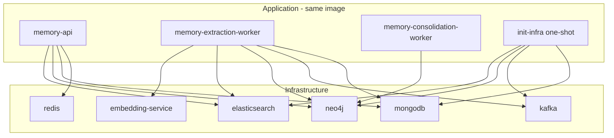

# DEV-003 Docker Compose、Embedding 服务与 Preflight

## 1. 任务信息

```yaml
task_id: DEV-003
task_name: Docker Compose、Embedding 服务与 Preflight
status: completed
spec_sections:
  - "§3.2 应用容器与进程边界"
  - "§3.3 Docker Compose 服务拓扑"
  - "§3.4 单仓库目录结构（Dockerfile、compose*、versions*、scripts）"
  - "§3.10 本地 Embedding 部署方式（TEI 1.9.3、compose wrapper、start_embedding.sh、lock script）"
  - "§3.11 Apache Kafka KRaft 部署"
  - "§3.12 基础设施初始化（init-infra Compose 接线）"
  - "§3.13 Docker Image 构建规范"
  - "§3.14 Docker Compose 持久化与端口"
  - "§3.15 宿主机代理端口 7890"
  - "§3.16 健康检查与就绪规则（Compose healthcheck / depends_on）"
  - "§3.17 MVP 部署与开发命令"
  - "§3.18 基础设施版本与部署模式"
  - "§3.25 优雅关闭（Compose stop_grace_period 与 shutdown YAML 对齐）"
  - "§3.30 P1（Preflight、裸 docker compose 禁止）"
prerequisites:
  - "DEV-002 completed（settings、configs/*.yaml、.env.example、scripts/check_env_example.py；main @ 0b91a34 或更新）"
  - "实施编码前须 PLAN_APPROVED；PRE-ENV-001/002 已 satisfied"
branch: "feat/DEV-003-docker-compose-embedding-preflight"
created_at: "2026-08-07 10:09 UTC"
updated_at: "2026-08-07 10:33 UTC"
approval_gates:
  planning_docs: "Round 1 PLAN_REJECTED（MF-001、MF-002、SF-001–005）；Amendment 001 修订；Round 2 PLAN_APPROVED（BLOCKER 0 / MUST_FIX 0 / SHOULD_FIX 5 非阻塞）；人工确认 PLAN_APPROVED（2026-08-07 10:33 UTC）"
  implementation_plan: "status=approved；plan_commit=null（待人工 docs(plan) on main）；未实施、未创建 feat 分支"
plan_review:
  round_1: "PLAN_REJECTED（BLOCKER 0 / MUST_FIX 2 / SHOULD_FIX 5）"
  round_2: "PLAN_APPROVED（BLOCKER 0 / MUST_FIX 0 / SHOULD_FIX 5 非阻塞）"
```

## 2. 任务目标

本任务交付 **可复现的 Docker Compose 基础设施拓扑**、**TEI Embedding 服务部署链路** 与 **Linux 宿主机 Preflight**，使后续 DEV-004+ 可通过统一 Wrapper 启动/校验环境，不得在业务模块散落裸 `docker compose` 调用。

完成后应具备：

1. **统一 Compose Wrapper**：`scripts/compose.sh` 为唯一入口；支持 `--embedding=none|cpu|gpu|current`；按固定顺序加载 `.env` → `versions.env` → `versions.lock.env` → `.runtime/embedding.env`（存在时）；内部 `exec docker compose ... "$@"`。
2. **完整 Compose 拓扑（§3.3）**：`memory-api`、`memory-extraction-worker`、`memory-consolidation-worker`、`embedding-service`、`redis`、`mongodb`、`kafka`、`neo4j`、`elasticsearch`、`init-infra`；内部网络 `memory-system-network`；持久化 Volume 与 Health Check。
3. **版本锁定**：`versions.env` 声明全部基础设施 Tag 与 TEI 来源标签；`versions.lock.env` 由 `scripts/lock_tei_images.sh` 生成并提交，含 `@sha256:` Digest 锁定的 `TEI_CPU_IMAGE` / `TEI_GPU_IMAGE`。
4. **Embedding 部署（§3.10）**：`compose.embedding.cpu.yaml` / `compose.embedding.gpu.yaml` 互斥覆盖同一 `embedding-service`；`scripts/start_embedding.sh` 支持 `cpu`/`gpu`/`auto`；生成 `.runtime/embedding.env`（`EMBEDDING_EFFECTIVE_RUNTIME_MODE`、`EMBEDDING_CLIENT_TOTAL_TOKEN_BUDGET`）；经 Wrapper 仅启动 `embedding-service`。
5. **应用镜像**：多阶段 `Dockerfile`（`python:3.12.13-slim-bookworm`）；`uv sync --locked`；非 root 运行；三应用容器共用同一镜像、不同 `command`。
6. **Preflight**：`scripts/preflight/check_linux_host.sh` 实现 §3.18 Preflight 清单（Linux、Docker、Compose v2、`vm.max_map_count`、内存门槛、TEI lock 校验、代理可选检查等）。
7. **测试 Compose**：`compose.test.yaml` 独立项目名/容器名/Volume/测试库，禁止复用开发持久化数据。
8. **与 DEV-002 衔接**：三应用容器（`memory-api`、`memory-extraction-worker`、`memory-consolidation-worker`）**确定性**获得 `Settings.required_env_keys()` 全部键（见 §7.6）；`env_file` 与 `environment:` 分工明确；禁止依赖 `--env-file` 隐式继承；`versions.env` 中 `EMBEDDING_MODEL_ID` / `EMBEDDING_MODEL_REVISION` 与 `configs/base.yaml` `memory_retrieval` 及 Settings `EMBEDDING__*` 对齐。
9. **静态门禁**：CI/契约测试禁止除 `scripts/compose.sh` 与说明文档外的裸 `docker compose` 字符串。

## 3. 非目标

- `scripts/migrate.py`、`scripts/migrations/001`–`004` 业务 Migration 逻辑（**DEV-004**）；本任务仅 `init-infra` Compose 接线（`command: python -m scripts.migrate`），**不**实现 Runner 或 Migration 脚本。
- `init-infra` **成功执行并完成初始化**的验收（**DEV-004**）；DEV-003 仅验证 Compose 定义与 `compose.sh config` 可解析。
- FastAPI 应用壳、鉴权、Lifespan、Readiness 探针业务逻辑（**DEV-005**）。
- `TEIEmbeddingClient`、Token 分批、向量一致性 Contract（**DEV-006**）。
- `src/memory_system/infrastructure/**` 具体 Client 实现。
- 将三 Entrypoint 改为可对外提供业务 API（保持未就绪非零退出；Compose 可定义容器，启动失败直至 DEV-005 接线属预期）。
- 真实 CI workflow 文件（**OPS-004**）；本任务仅交付可被后续 CI 调用的脚本与契约/集成测试。
- `pyproject.toml` / `uv.lock` 依赖版本变更（除非 Plan Review 发现缺漏且属规格既有依赖）。
- OpenTelemetry、Kubernetes、生产 TLS/认证。
- 修改 `tests/conftest.py`（DEV-001 占位；各新测试文件内局部 fixture）。
- 修改 `src/memory_system/settings/**`（DEV-002 已完成；Compose 通过 env 注入，不改 Settings 代码）。

## 4. 当前代码状态

- **已存在代码**：DEV-001 骨架（`scripts/__init__.py`、`scripts/migrations/__init__.py`、`scripts/preflight/.gitkeep`）；DEV-002 配置（`configs/`、`.env.example`、`settings/`、`check_env_example.py`）；`.dockerignore`、`.gitignore`（**尚无** `.runtime/` 忽略项）。
- **可复用组件**：`configs/base.yaml` 中 `embedding` / `memory_retrieval` 默认值；`.env.example` 中 `EMBEDDING__*`、`EMBEDDING_EFFECTIVE_RUNTIME_MODE`、`EMBEDDING_CLIENT_TOTAL_TOKEN_BUDGET`、`PROXY__HTTP_URL`；`Settings.required_env_keys()`；DEV-002 shutdown grace 校验常量（450/270/270 < 480/300/300）。
- **当前缺失**：`Dockerfile`；全部 `compose*.yaml`；`versions.env`、`versions.lock.env`；`scripts/compose.sh`、`start_embedding.sh`、`lock_tei_images.sh`、`preflight/check_linux_host.sh`；Compose/Embedding/Preflight 相关测试。
- **与技术规格不一致之处**：§3.3–§3.4、§3.10、§3.17–§3.18 要求的 Compose/Docker/Embedding/Preflight 尚未创建；README 仍声明 Compose 不可用。
- **前置任务检查**：DEV-002 `completed`；`main` @ `0b91a34`，工作区干净；PRE-ENV-001/002 satisfied。

## 5. 文件白名单（本任务允许创建/修改的全部路径）

禁止使用 `compose*`、`scripts/**`、`tests/**` 通配作为变更描述。实施时**仅允许**触及下列路径：

### 5.1 Docker 与 Compose（仓库根）

| 路径 | 创建/修改 | 说明 |
|---|---|---|
| `Dockerfile` | 创建 | 多阶段 build；`ARG PYTHON_IMAGE` 来自 `versions.env`；`uv sync --locked`；非 root runtime |
| `compose.yaml` | 创建 | 基础拓扑：全部 §3.3 服务、网络、Volume、healthcheck、`depends_on`、grace period、代理 `extra_hosts` |
| `compose.override.yaml` | 创建 | 开发调试：§3.14 端口绑定 `127.0.0.1`、可选 debug profile |
| `compose.embedding.cpu.yaml` | 创建 | §3.10.3 CPU TEI Override；`TEI_CPU_IMAGE`；`AUTO_TRUNCATE=false`；`mem_limit: 8g` |
| `compose.embedding.gpu.yaml` | 创建 | §3.10.4 GPU TEI Override；`TEI_GPU_IMAGE`；NVIDIA device reservation |
| `compose.test.yaml` | 创建 | 独立 `name`/容器名/Volume/测试库；与 dev 持久化隔离 |
| `versions.env` | 创建 | §3.18 全部基础设施 Tag + TEI 来源标签 + Embedding 模型变量（§5.4） |
| `versions.lock.env` | 创建 | `lock_tei_images.sh --update` 生成的 Digest 锁定 TEI 镜像（**不得**含占位 `<digest>`） |

### 5.2 Shell 脚本（`scripts/`）

| 路径 | 创建/修改 | 说明 |
|---|---|---|
| `scripts/compose.sh` | 创建 | 唯一 Compose Wrapper；`--embedding`；`--stack=dev|test`；env 文件加载顺序；`exec docker compose` |
| `scripts/start_embedding.sh` | 创建 | `cpu`/`gpu`/`auto`；生成 `.runtime/embedding.env`；仅 `up -d embedding-service` |
| `scripts/lock_tei_images.sh` | 创建 | 校验/更新 `versions.lock.env`；`--version` 语义解析 `1.9.3`；默认只校验，`--update` 才改写 |
| `scripts/preflight/check_linux_host.sh` | 创建 | §3.18 Preflight；支持 `--mode=cpu|gpu|auto`；硬失败非零、仅 Warning 为零 |

### 5.3 仓库元数据

| 路径 | 创建/修改 | 说明 |
|---|---|---|
| `.gitignore` | 修改 | 增加 `.runtime/`（`embedding.env` 不提交） |
| `README.md` | 修改 | 更新 Phase 0 状态、§3.17 标准启动顺序（经 `compose.sh`） |
| `.dockerignore` | 修改（仅当 Dockerfile build context 需要） | 确保不 COPY 治理文档/测试缓存进镜像；**不得**移除既有安全忽略项 |

### 5.4 测试

| 路径 | 创建/修改 | 说明 |
|---|---|---|
| `tests/unit/test_compose_wrapper_contract.py` | 创建 | 裸 `docker compose` 静态扫描；`compose.sh`/`start_embedding.sh`/`lock_tei_images.sh` 存在性与关键子串 |
| `tests/unit/test_versions_env_contract.py` | 创建 | `versions.env` 必需键、Tag 与 §3.18 一致；`versions.lock.env` Digest 格式 |
| `tests/contract/test_compose_config_contract.py` | 创建 | 经 `compose.sh` 执行 `config`（`--embedding=none/cpu` 等）；解析 YAML 断言服务名、grace、env 映射 |
| `tests/integration/test_preflight_linux_host.py` | 创建 | 本机 Linux + Docker 可用时运行 preflight；否则 `pytest.skip`；**禁止**裸 `docker compose` |
| `02_开发管理/tasks/DEV-003-docker-compose-embedding-preflight.md` | 修改 | 本 Task Plan（含 Amendment 001） |
| `02_开发管理/progress.md` | 修改 | 规划态 / 批准态字段（`current_task_status=approved`；`next_action=人工 docs(plan) on main`） |
| `02_开发管理/master_plan.md` | 修改 | DEV-003 登记（CHANGE-005 Amendment 001） |

**Amendment 预留（SF-001 决策占位）**：`tests/conftest.py` **不在白名单**、**禁止修改**。集成测试所需临时目录/fixture 在各测试文件内定义。

### 5.5 治理文档（本规划轮次由 Planner 更新；实施阶段 Developer 可回写执行记录）

| 路径 | 说明 |
|---|---|
| `02_开发管理/tasks/DEV-003-docker-compose-embedding-preflight.md` | 本 Task Plan |
| `02_开发管理/progress.md` | 规划态 / 实施态字段 |
| `02_开发管理/master_plan.md` | DEV-003 登记（CHANGE-005） |

## 6. 文件黑名单（禁止本任务创建或修改）

| 路径 / 模式 | 归属 |
|---|---|
| `scripts/migrate.py` | DEV-004 |
| `scripts/migrations/001_initial_mongodb.py`–`004_initial_kafka_topics.py` | DEV-004 |
| `src/memory_system/api/dependencies.py`、`middleware.py`、`error_handlers.py` | DEV-005 |
| `src/memory_system/api/routes/` 下除既有 `__init__.py` 外的业务路由 | DEV-005+ |
| `src/memory_system/infrastructure/**` 下具体 Client 实现（含 `infrastructure/embedding/**`） | DEV-006 及后续 |
| `src/memory_system/settings/**` | DEV-002（已完成；本任务不改） |
| `src/memory_system/entrypoints/*.py` 业务启动逻辑（除 import 兼容性外不得改为假成功） | DEV-005 / 后续 |
| `configs/base.yaml`、`configs/development.yaml`、`configs/test.yaml` | DEV-002（除非 Plan Review 发现与 Compose 变量名冲突且需注释级交叉引用——默认不改） |
| `.env.example` | DEV-002（衔接通过既有键与注释；默认不改） |
| `scripts/check_env_example.py` | DEV-002 |
| `scripts/republish_archive_event.py` | STM-011 |
| `.env`（真实 Secret） | 永不提交 |
| `tests/conftest.py` | DEV-001 占位 |
| `pyproject.toml` / `uv.lock` 依赖变更 | 非本任务范围（除非审查发现缺漏） |
| `.github/workflows/**` | OPS-004 |
| 任何文档/脚本/Makefile 中新增裸 `docker compose`（`scripts/compose.sh` 内部与规格说明文档除外） | 工程规范违反 |

## 7. 环境变量与版本映射（规格对齐）

### 7.1 `versions.env`（提交 Git；无 Secret）

| 变量 | 规格依据 | 固定值 / 来源 |
|---|---|---|
| `PYTHON_IMAGE` | §3.13、§3.18 | `python:3.12.13-slim-bookworm` |
| `REDIS_IMAGE` | §3.18 | `redis:8.6.5` |
| `MONGODB_IMAGE` | §3.18 | `mongo:8.0.28` |
| `KAFKA_IMAGE` | §3.18 | `apache/kafka:4.3.1` |
| `NEO4J_IMAGE` | §3.18 | `neo4j:5.26.28-community` |
| `ELASTICSEARCH_IMAGE` | §3.18 | `docker.elastic.co/elasticsearch/elasticsearch:9.4.4` |
| `TEI_EXPECTED_VERSION` | §3.10.1、§3.18 | `1.9.3` |
| `TEI_CPU_IMAGE_SOURCE` | §3.10.1 | `ghcr.io/huggingface/text-embeddings-inference:cpu-1.9` |
| `TEI_GPU_IMAGE_SOURCE` | §3.10.1 | `ghcr.io/huggingface/text-embeddings-inference:86-1.9` |
| `EMBEDDING_MODEL_ID` | §3.10.1、§3.2 | `BAAI/bge-m3`（与 `memory_retrieval.embedding_model`、`EMBEDDING__MODEL_ID` 一致） |
| `EMBEDDING_MODEL_REVISION` | §3.10.1 | `57aacf8560157b7c1d4f771ce1a199877aeeec74`（与 `memory_retrieval.embedding_model_revision` 一致） |

Compose 基础设施镜像**必须**使用 `${REDIS_IMAGE}` 等形式引用，禁止在 `compose*.yaml` 内重复硬编码 Tag。

### 7.2 `versions.lock.env`（提交 Git；由锁定脚本生成）

| 变量 | 说明 |
|---|---|
| `TEI_CPU_IMAGE` | `ghcr.io/huggingface/text-embeddings-inference:cpu-1.9@sha256:<真实 digest>` |
| `TEI_GPU_IMAGE` | `ghcr.io/huggingface/text-embeddings-inference:86-1.9@sha256:<真实 digest>` |

规则：禁止提交占位符 `<cpu_image_digest>` / `<gpu_image_digest>`；实施阶段须在有网络环境执行 `./scripts/lock_tei_images.sh --update` 生成真实 Digest 后纳入功能 Commit。

### 7.3 `.runtime/embedding.env`（不提交 Git；`start_embedding.sh` 生成）

| 变量 | CPU | GPU | Settings 字段 |
|---|---|---|---|
| `EMBEDDING_EFFECTIVE_RUNTIME_MODE` | `cpu` | `gpu` | `embedding_effective_runtime_mode` |
| `EMBEDDING_CLIENT_TOTAL_TOKEN_BUDGET` | `4096` | `16384` | `embedding_client_total_token_budget` |

与 `configs/base.yaml` `embedding.cpu/gpu.client_total_token_budget` 及 DEV-002 `.env.example` 注释一致。`auto` 不是应用可见模式；脚本解析后只写入 `cpu` 或 `gpu`。

### 7.4 DEV-002 衔接（`.env` / Settings / Compose）

`Settings.required_env_keys()`（`src/memory_system/settings/models.py` `_REQUIRED_ENV_KEYS`）为**单一来源**；契约测试必须与该 tuple 对齐，禁止手写漂移列表。

| DEV-002 键 | 注入方式（三应用容器一致，见 §7.6） |
|---|---|
| `APP_ENV` | `env_file: [.env]` |
| `REDIS__URI`、`MONGODB__URI`、`KAFKA__BOOTSTRAP_SERVERS`、`NEO4J__URI`、`ELASTICSEARCH__URL` | `env_file: [.env]` |
| `LLM__BASE_URL`、`LLM__API_KEY`、`LLM__COMPRESSION__MODEL`、`LLM__EXTRACTION__MODEL` | `env_file: [.env]` |
| `EMBEDDING__MODEL_ID`、`EMBEDDING__BASE_URL` | `env_file: [.env]`（值与 `.env.example` / `versions.env` `EMBEDDING_MODEL_ID` 一致） |
| `MEMORY_API_KEY`、`MEMORY_ADMIN_API_KEY` | `env_file: [.env]` |
| `PROXY__HTTP_URL` | `env_file: [.env]`（Settings 允许空；见 §7.6.4） |
| `EMBEDDING_EFFECTIVE_RUNTIME_MODE` | **仅** `environment:` 显式 `${EMBEDDING_EFFECTIVE_RUNTIME_MODE}`；Compose 变量来自 `compose.sh` 加载的 `.runtime/embedding.env`（§3.10.5） |
| `EMBEDDING_CLIENT_TOTAL_TOKEN_BUDGET` | **仅** `environment:` 显式 `${EMBEDDING_CLIENT_TOTAL_TOKEN_BUDGET}`；来源同上 |

`scripts/compose.sh` 对 **Compose CLI** 的 `--env-file` 加载链（变量插值来源，**不等于**容器自动注入）：`.env` → `versions.env` → `versions.lock.env` → `.runtime/embedding.env`（存在时）。**禁止**假设该链自动向容器传播任意键；应用容器必须通过 §7.6 的 `env_file` + `environment:` 确定性注入。

TEI `embedding-service` 使用 `versions.env` 的 `EMBEDDING_MODEL_ID` / `EMBEDDING_MODEL_REVISION` 与 `versions.lock.env` 的 `TEI_*_IMAGE`；**不**读取 `.runtime/embedding.env`。

### 7.6 三应用容器环境注入矩阵（Amendment 001 MF-001）

三应用容器（`memory-api`、`memory-extraction-worker`、`memory-consolidation-worker`）**必须**使用**相同** env 注入模式（YAML anchor `x-app-env` 或等价重复块；禁止三容器行为不一致）。

#### 7.6.1 `env_file`（每容器）

```yaml
env_file:
  - .env
```

经 `env_file` 进入容器的键（与 `required_env_keys()` 交集，**不含**运行时解析键）：

| 键 | 来源文件 | 说明 |
|---|---|---|
| `APP_ENV` | `.env` | 开发者复制自 `.env.example` |
| `REDIS__URI`、`MONGODB__URI`、`KAFKA__BOOTSTRAP_SERVERS`、`NEO4J__URI`、`ELASTICSEARCH__URL` | `.env` | 内部 DNS 与 §3.3 服务名一致 |
| `LLM__BASE_URL`、`LLM__API_KEY`、`LLM__COMPRESSION__MODEL`、`LLM__EXTRACTION__MODEL` | `.env` | Secret 不得进入 `versions.env` |
| `EMBEDDING__MODEL_ID`、`EMBEDDING__BASE_URL` | `.env` | 与 `.env.example` 默认一致 |
| `MEMORY_API_KEY`、`MEMORY_ADMIN_API_KEY` | `.env` | |
| `PROXY__HTTP_URL` | `.env` | 可为空字符串；**仍须**出现在容器环境供 Settings 读取 |

**禁止**将 `.runtime/embedding.env`、`versions.env`、`versions.lock.env` 列为应用容器 `env_file`（运行时模式与 Digest 经 `compose.sh` CLI 链 + 显式 `environment:` 注入）。

#### 7.6.2 `environment:` 显式映射（每容器）

```yaml
environment:
  EMBEDDING_EFFECTIVE_RUNTIME_MODE: ${EMBEDDING_EFFECTIVE_RUNTIME_MODE}
  EMBEDDING_CLIENT_TOTAL_TOKEN_BUDGET: ${EMBEDDING_CLIENT_TOTAL_TOKEN_BUDGET}
  HTTP_PROXY: ${PROXY__HTTP_URL}
  HTTPS_PROXY: ${PROXY__HTTP_URL}
  NO_PROXY: "localhost,127.0.0.1,redis,mongodb,kafka,neo4j,elasticsearch,embedding-service,memory-api,memory-extraction-worker,memory-consolidation-worker"
```

| 键 | Compose 插值来源 | 写入容器 |
|---|---|---|
| `EMBEDDING_EFFECTIVE_RUNTIME_MODE` | `.runtime/embedding.env`（经 `compose.sh` `--env-file`） | 显式 `environment:` |
| `EMBEDDING_CLIENT_TOTAL_TOKEN_BUDGET` | `.runtime/embedding.env` | 显式 `environment:` |
| `HTTP_PROXY` / `HTTPS_PROXY` | `.env` 中 `PROXY__HTTP_URL`（经 `compose.sh` 加载 `.env` 后插值） | 显式 `environment:` |
| `NO_PROXY` | `compose.yaml` 字面量（§3.15.3） | 显式 `environment:` |

`memory-consolidation-worker` **同样**接收上述块（满足 `required_env_keys()` 全集）；LLM 出站代理按 §3.15.3 主要服务于 `memory-api` / `memory-extraction-worker`，但注入规则仍保持一致以避免 Settings 加载差异。

#### 7.6.3 `EMBEDDING_*` 运行时键来源与生产写入

| 阶段 | 行为 |
|---|---|
| 开发者首次 | `cp .env.example .env`；`.env` 可含占位 `EMBEDDING_EFFECTIVE_RUNTIME_MODE=cpu` / `EMBEDDING_CLIENT_TOTAL_TOKEN_BUDGET=4096`（本地非 Compose 场景） |
| Preflight / 启动前 | `scripts/start_embedding.sh {cpu\|gpu\|auto}` **原子写入** `.runtime/embedding.env`（`mkdir -p .runtime` → 临时文件 → `mv`） |
| Compose 启动 | `compose.sh` 将 `.runtime/embedding.env` 作为**最后** `--env-file` 加载，供 `${EMBEDDING_*}` 插值；**不**作为容器 `env_file` |
| `auto` 回退 | GPU 路径失败 → 清理失败容器 → 重写 `.runtime/embedding.env` 为 `cpu`/`4096` → 再启动 CPU override |

`versions.env` **不**提供 `EMBEDDING_EFFECTIVE_RUNTIME_MODE` / `EMBEDDING_CLIENT_TOTAL_TOKEN_BUDGET`（仅 TEI 模型 Tag 与 `EMBEDDING_MODEL_*`）。

#### 7.6.4 `PROXY__HTTP_URL` → 代理三元组规则

| 规则 | 说明 |
|---|---|
| 容器内地址 | **必须**使用 `http://host.docker.internal:7890`（`.env.example` 默认），**禁止** `127.0.0.1:7890` |
| `extra_hosts` | 三应用容器 + `embedding-service`（模型下载）均配置 `host.docker.internal:host-gateway` |
| `PROXY__HTTP_URL` 非空 | `HTTP_PROXY`/`HTTPS_PROXY` = 其值；Preflight 检查宿主机 `7890` 可连接（§3.18 #6） |
| `PROXY__HTTP_URL` 为空或未设置 | `HTTP_PROXY`/`HTTPS_PROXY` 插值为空；Preflight **跳过** 7890 检查 |
| `NO_PROXY` | 固定字面量（§3.15.3 全服务名列表）；不随 `PROXY__HTTP_URL` 变化 |
| 基础设施服务 | `redis`/`mongodb`/`kafka`/`neo4j`/`elasticsearch` **不**注入 HTTP 代理 |

#### 7.6.5 契约测试要求（`required_env_keys` 全覆盖）

`tests/contract/test_compose_config_contract.py` 必须：

1. 经 `./scripts/compose.sh --embedding=cpu config`（或 `gpu`）解析 YAML；
2. 对 `memory-api`、`memory-extraction-worker`、`memory-consolidation-worker` 各断言：
   - `env_file` 含 `.env`；
   - `environment` 含 `EMBEDDING_EFFECTIVE_RUNTIME_MODE`、`EMBEDDING_CLIENT_TOTAL_TOKEN_BUDGET`、`HTTP_PROXY`、`HTTPS_PROXY`、`NO_PROXY`；
   - 经 `env_file` + `environment` 并集覆盖 `Settings.required_env_keys()` **每一个**键（`PROXY__HTTP_URL` 经 `env_file`；`EMBEDDING_*` 经 `environment`）；
3. **禁止**在测试中直接 `docker compose config`（须经 Wrapper）。

### 7.5 Preflight 内存门槛（脚本内常量，与规格 §3.18 一致）

```yaml
preflight:
  cpu_mode:
    minimum_available_memory_gib: 12
    recommended_available_memory_gib: 16
  gpu_mode:
    minimum_available_memory_gib: 8
    recommended_available_memory_gib: 12
```

GPU 空闲显存阈值：`8192` MiB（与 `configs/base.yaml` `embedding.gpu.minimum_free_memory_mb` 一致）。

## 8. 实现方案

### Step 0 — 状态回写（强制，贯穿实施）

- 实施开始：`current_task_status` → `in_progress`（progress + 本文件）。
- 实现完成 → `implemented`；测试通过 → `tested`；审查通过 → `reviewed`；Commit 后 → `committed`。
- **禁止**任务结束时一次性补写状态。

### Step 1 — `versions.env` 与 `versions.lock.env`

- **文件**：`versions.env`、`versions.lock.env`（初始由 lock 脚本生成）
- **行为**：
  1. 按 §7.1 写入全部基础设施 Tag 与 TEI 来源标签。
  2. 实施者在有 Docker 网络的环境执行 `./scripts/lock_tei_images.sh --update`，拉取 CPU/GPU 来源镜像，`text-embeddings-router --version` 严格解析为 `1.9.3`，写入 RepoDigest 至 `versions.lock.env`，原子替换。
  3. 日常/CI 默认执行 `./scripts/lock_tei_images.sh`（无 `--update`）仅校验 Digest 与版本，失败非零。
- **错误处理**：Digest 缺失、无 `@sha256:`、版本 ≠ `1.9.3`、来源标签漂移至未批准 Patch → 硬失败。
- **幂等**：`--update` 仅在显式传入时改写 lock 文件；否则只读校验。

### Step 2 — 多阶段 `Dockerfile`

- **文件**：`Dockerfile`
- **阶段**：
  1. `builder`：`FROM ${PYTHON_IMAGE}`；安装 `uv`；`COPY pyproject.toml uv.lock`；`uv sync --locked --no-dev`（或等价生产依赖集）。
  2. `runtime`：复制 venv 与 `src/`、`configs/`、`scripts/__init__.py`（**不**复制治理文档、测试、`01_技术规格/`）；创建非 root 用户；默认无 CMD（由 Compose `command` 指定三入口）。
- **Build Args**：`PYTHON_IMAGE`、`HTTP_PROXY`、`HTTPS_PROXY`、`NO_PROXY`（构建时传入，**禁止** `ENV` 永久写入代理）。
- **禁止**：将数据库/模型权重打入镜像；使用 `python:3.12-slim` / `latest` 浮动 Tag。

### Step 3 — `compose.yaml` 基础拓扑

- **服务**（§3.3）：

| 服务 | 镜像 | 要点 |
|---|---|---|
| `redis` | `${REDIS_IMAGE}` | AOF；Volume `redis-data`；healthcheck |
| `mongodb` | `${MONGODB_IMAGE}` | Volume `mongodb-data`；healthcheck |
| `kafka` | `${KAFKA_IMAGE}` | KRaft combined；Volume `kafka-data`；内部 + 可选宿主机 listener |
| `neo4j` | `${NEO4J_IMAGE}` | Community；`neo4j-data`/`neo4j-logs`；Bolt `7687` |
| `elasticsearch` | `${ELASTICSEARCH_IMAGE}` | `discovery.type=single-node`；`xpack.security.enabled=false`；`mem_limit: 2g`；`nofile: 65535`；仅内部网络 |
| `embedding-service` | 由 CPU/GPU override 提供 | 基础 compose **不**固定 image；无 override 时 `--embedding=none` 不包含可运行 TEI 定义 |
| `memory-api` | 应用镜像 build | `command: python -m memory_system.entrypoints.api`；`stop_grace_period: 480s`；§7.6 `env_file` + `environment`；`extra_hosts` |
| `memory-extraction-worker` | 同上 | `stop_grace_period: 300s`；§7.6 同 `memory-api` |
| `memory-consolidation-worker` | 同上 | `stop_grace_period: 300s`；§7.6 同 `memory-api`（`required_env_keys` 全集） |
| `init-infra` | 应用镜像 build | `command: python -m scripts.migrate`；`profiles` 或 `restart: "no"` 一次性；depends_on healthy 基础设施 |

- **网络**：`memory-system-network`（bridge）。
- **Volumes**：§3.14 全部（含 `embedding-model-cache`）。
- **代理**：`NO_PROXY` 含全部内部服务名（§7.6.4）；`memory-api` / `memory-extraction-worker` / `memory-consolidation-worker` 经 `environment` 注入 `HTTP_PROXY`/`HTTPS_PROXY`（来自 `PROXY__HTTP_URL`）；`embedding-service` 仅模型下载时同规则。
- **depends_on**：基础设施 `service_healthy`；应用服务依赖基础设施（**不要求** embedding 阻塞 `memory-api` 启动，§3.16）。



### Step 4 — `compose.override.yaml`（开发）

- 绑定 §3.14 端口至 `127.0.0.1`（`8000`、`6379`、`27017`、`7474`、`7687`、`9200` 等）。
- `embedding-service` **默认不对宿主机暴露**（规格 §3.14）；调试如需 `8080` 仅 `127.0.0.1`。
- Elasticsearch **禁止** `0.0.0.0:9200`。

### Step 5 — Embedding Override 文件

- **`compose.embedding.cpu.yaml`**：§3.10.3 全文结构；`image: ${TEI_CPU_IMAGE}`；`AUTO_TRUNCATE=false`；command 参数引用 `${EMBEDDING_MODEL_ID}`、`${EMBEDDING_MODEL_REVISION}`；`float32`；`max-batch-tokens: 8192`；`mem_limit: 8g`；`cpus: 4.0`；Volume `embedding-model-cache`。
- **`compose.embedding.gpu.yaml`**：§3.10.4；`image: ${TEI_GPU_IMAGE}`；`float16`；`max-batch-tokens: 16384`；NVIDIA device reservation。
- **互斥**：Wrapper 不得同时 `-f` 两个 embedding 文件。

### Step 6 — `compose.test.yaml`

- `name: memory-system-test`（或等价独立 project name）。
- 全部 Volume/容器名加 `-test` 后缀或独立命名空间。
- 测试用数据库名/Neo4j 库/ES index 前缀与 dev 隔离（具体值在 compose 环境变量中固定，Migration 细节属 DEV-004）。

**Compose 文件 `-f` 顺序与 Override 语义（Amendment 001 SF-004）**：

| `--stack` | `-f` 顺序（左→右，后者覆盖前者） |
|---|---|
| `dev`（默认） | `compose.yaml` → `compose.override.yaml` → `compose.embedding.{cpu\|gpu}.yaml`（当 `--embedding` 为 `cpu`/`gpu`/`current` 且已解析） |
| `test` | `compose.yaml` → `compose.test.yaml` → `compose.embedding.{cpu\|gpu}.yaml`（同上） |
| `none` | `compose.yaml` → `compose.override.yaml` 或 `compose.test.yaml`；**不**追加 embedding override |

规则：

1. `compose.sh` 脚本头部注释与契约测试必须断言上述顺序字符串/逻辑一致。
2. `compose.test.yaml` **替换** `compose.override.yaml`（二者互斥追加，test 栈不加载 dev override）。
3. Embedding override **始终最后**加载，确保覆盖 `embedding-service` 定义。
4. `--embedding=none` 时不得 `-f compose.embedding.*.yaml`。

### Step 7 — `scripts/compose.sh`

- **接口**：

```text
./scripts/compose.sh [--embedding=none|cpu|gpu|current] [--stack=dev|test] <docker compose subcommand> [args...]
```

- **默认**：`--embedding=current`；若 `.runtime/embedding.env` 不存在且未显式 `none|cpu|gpu` → 失败并提示先 `start_embedding.sh` 或显式传参。
- **Env 加载顺序**（对每个 `--env-file` 或 `export` 等效）：`.env` → `versions.env` → `versions.lock.env` → `.runtime/embedding.env`（存在时）。
- **Compose 文件顺序**：`compose.yaml` + `compose.override.yaml`（dev）或 `compose.test.yaml`（test）+ 可选 `compose.embedding.{cpu,gpu}.yaml`。
- **实现**：`set -euo pipefail`；末尾 `exec docker compose ... "$@"`。
- **校验**：`current` 模式解析 `EMBEDDING_EFFECTIVE_RUNTIME_MODE` 仅允许 `cpu|gpu`；校验 `EMBEDDING_CLIENT_TOTAL_TOKEN_BUDGET` 与模式匹配（4096/16384）。

### Step 8 — `scripts/start_embedding.sh`

- **参数**：`cpu` | `gpu` | `auto`（缺省可视为 `auto`，须在脚本用法中写明）。
- **`cpu`**：无条件 CPU override；写 `.runtime/embedding.env`（mode=cpu, budget=4096）。
- **`gpu`**：检查 nvidia-smi、Container Toolkit、RTX A5000 可见、空闲显存 ≥ 8192 MiB；不满足 → **失败**，不自动降级。
- **`auto`**：按 §3.10.5 流程图检测；GPU 健康检查失败 → 清理失败容器 → 回退 CPU 并**原子更新** `.runtime/embedding.env`。
- **启动**：仅 `./scripts/compose.sh --embedding=<resolved> up -d embedding-service`（命令末尾必须指定服务名）。
- **前置检查**：`TEI_*_IMAGE` 含 `@sha256:`，否则提示运行 `lock_tei_images.sh` 并退出非零。
- **代理**：模型首次下载时 `embedding-service` 使用 `PROXY__HTTP_URL` 映射的代理（经 compose 环境）。

### Step 9 — `scripts/lock_tei_images.sh`

- 读取 `versions.env` 中 `TEI_CPU_IMAGE_SOURCE`、`TEI_GPU_IMAGE_SOURCE`、`TEI_EXPECTED_VERSION`。
- 对两镜像执行 `docker run --rm --entrypoint text-embeddings-router ... --version`，严格语义版本解析等于 `1.9.3`。
- 解析 `RepoDigest`，写入临时 `versions.lock.env`，验证可 `docker pull`，原子 `mv` 替换。
- 默认无 `--update`：校验现有 lock 文件 Digest 可拉取且版本仍为 `1.9.3`。
- `--update`：重新拉取来源标签；若来源标签对应版本 ≠ `TEI_EXPECTED_VERSION` → 失败。

### Step 10 — `scripts/preflight/check_linux_host.sh`（§3.18 全文；Amendment 001 MF-002）

- **参数**：`--mode=cpu|gpu|auto`（默认 `auto`）；`--help` 输出用法。
- **退出码**：任一硬失败 → `1`；仅 Warning → `0`（stderr 输出 `WARNING:` 前缀行）。
- **诊断输出**：每项检查打印 `PASS`/`FAIL`/`WARN`/`SKIP`；结束时输出**解析后的有效模式**、`EMBEDDING_CLIENT_TOTAL_TOKEN_BUDGET`、**最终 TEI CPU/GPU 镜像 Digest**（从 `versions.lock.env` 读取 `TEI_CPU_IMAGE`/`TEI_GPU_IMAGE` 的 `@sha256:` 部分；§3.10.9 #8）。

#### 10.1 `auto` 模式 GPU-first 决策流（硬失败前不得启动基础设施）

```text
--mode=auto
    ↓
[GPU 路径评估]
  1. nvidia-smi 可用？
  2. docker info 显示 NVIDIA Container Runtime？
  3. 可见 GPU 含 RTX A5000？
  4. 空闲显存 ≥ 8192 MiB？
  5. MemAvailable ≥ gpu_mode.minimum (8 GiB)？
    ↓ 全部满足
resolved_mode=gpu；resolved_budget=16384
    ↓ 任一不满足
[CPU 路径评估]
  6. MemAvailable ≥ cpu_mode.minimum (12 GiB)？
    ↓ 满足
resolved_mode=cpu；resolved_budget=4096
    ↓ 不满足
硬失败（退出 1）；禁止部分启动基础设施
```

`--mode=gpu`：**仅**走 GPU 路径；任一 GPU 检查失败 → **硬失败**，**禁止**自动降级 CPU（与 `auto` 对比）。

`--mode=cpu`：**跳过**全部 NVIDIA 检查；使用 CPU 内存门槛；`resolved_mode=cpu`；`resolved_budget=4096`。

#### 10.2 检查项清单（硬失败 vs Warning vs 跳过）

| # | 检查项 | `cpu` | `gpu` | `auto` | 结果 |
|---|---|---|---|---|---|
| 1 | `uname` 为 Linux | ✓ | ✓ | ✓ | 非 Linux → **硬失败** |
| 2 | `docker info` 成功 | ✓ | ✓ | ✓ | 失败 → **硬失败** |
| 3 | `docker compose version` 为 v2 | ✓ | ✓ | ✓ | 非 v2 → **硬失败** |
| 4 | `sysctl vm.max_map_count` ≥ 1048576 | ✓ | ✓ | ✓ | 不足 → **硬失败** |
| 5 | 当前用户可访问 Docker socket | ✓ | ✓ | ✓ | 不可 → **硬失败** |
| 6 | 代理启用时宿主机 `7890` 可连接 | ✓ | ✓ | ✓ | `PROXY__HTTP_URL` 非空且不可连 → **硬失败**；空/未设 → **SKIP** |
| 7 | ES 数据 Volume 文件系统可用空间 | ✓ | ✓ | ✓ | < 20 GiB → **Warning**；≥ 20 GiB → PASS |
| 8 | `MemAvailable`（`/proc/meminfo`） | 见 10.3 | 见 10.3 | 见 10.1 | 低于 minimum → **硬失败**；minimum≤x<recommended → **Warning** |
| 9 | NVIDIA driver（`nvidia-smi`） | SKIP | ✓ | GPU 路径 | `gpu` 失败 → **硬失败**；`auto` GPU 路径失败 → 转 CPU 评估 |
| 10 | Docker NVIDIA runtime | SKIP | ✓ | GPU 路径 | 同上 |
| 11 | RTX A5000 可见 | SKIP | ✓ | GPU 路径 | 同上 |
| 12 | 空闲显存 ≥ 8192 MiB | SKIP | ✓ | GPU 路径 | 同上 |
| 13 | Docker 可为 ES 分配 `2g`、TEI `8g` mem_limit | ✓ | ✓ | ✓ | 不满足 → **硬失败** |
| 14 | `versions.lock.env` 存在；`TEI_*_IMAGE` 含 `@sha256:` | ✓ | ✓ | ✓ | 缺失/格式非法 → **硬失败** |
| 15 | 解析模式 ↔ Token Budget 一致 | ✓ | ✓ | ✓ | 见 10.4；不一致 → **硬失败** |
| 16 | 输出最终 TEI CPU/GPU Digest | ✓ | ✓ | ✓ | 诊断输出（§3.10.9 #8）；读取失败 → **硬失败** |

#### 10.3 内存门槛（`MemAvailable`，单位 GiB）

| 模式 | minimum（硬失败） | recommended（Warning only） |
|---|---|---|
| `cpu`（含 `auto` 选定 CPU） | 12 | 16 |
| `gpu`（含 `auto` 选定 GPU） | 8 | 12 |

比较：`MemAvailable_kib / 1024 / 1024 >= threshold_gib`。

#### 10.4 解析模式 ↔ `EMBEDDING_CLIENT_TOTAL_TOKEN_BUDGET` 一致性

| `resolved_mode` | 期望 budget |
|---|---|
| `cpu` | `4096` |
| `gpu` | `16384` |

校验时机（**不**仅当 `.runtime/embedding.env` 存在）：

1. Preflight 根据 `--mode` 与 10.1 决策流计算 `resolved_mode` / `resolved_budget`。
2. 若 `.runtime/embedding.env` **存在**：读取其中两键，必须与 `resolved_mode`/`resolved_budget` 一致；不一致 → **硬失败**。
3. 若 **不存在**：Preflight **不**失败（尚未 `start_embedding.sh`）；输出提示“将由 `start_embedding.sh` 写入”。
4. `compose.sh --embedding=current` 在 lock 校验之外，同样校验 `.runtime/embedding.env` 与 mode/budget 一致。

**生产协调**：Preflight 可先于 `start_embedding.sh` 运行（仅决策与门槛）；`start_embedding.sh` 负责按 Preflight 兼容的 `cpu`/`gpu`/`auto` 参数**写入** `.runtime/embedding.env`；二者 budget 映射规则必须相同。

#### 10.5 与 `start_embedding.sh` 职责边界

| 组件 | 职责 |
|---|---|
| `check_linux_host.sh` | 宿主机/ Docker / 内存 / GPU 门槛 / lock 文件 / 模式-budget 一致性 / Digest 诊断输出 |
| `start_embedding.sh` | 按 `cpu`/`gpu`/`auto` 启动 TEI；**写入** `.runtime/embedding.env`；`auto` GPU 失败清理并回退 CPU |
| `compose.sh` | 加载 env 链；`--embedding=current` 校验 runtime 文件 |

Preflight **不**启动容器；硬失败时开发者不得继续 §3.17 `up` 流程。

### Step 11 — `init-infra` 接线（不含 Migration 实现）

- `init-infra` 服务：`build` 应用镜像；`command: ["python", "-m", "scripts.migrate"]`；`depends_on` 基础设施 healthy；不常驻。
- **边界**：DEV-003 **不**创建 `scripts/migrate.py`；`compose.sh config` 可验证服务定义；`run --rm init-infra` 成功执行属 **DEV-004** 验收。
- 文档/README 中 §3.17 完整流程保留 `init-infra` 步骤，并注释“Migration Runner 由 DEV-004 提供”。

### Step 12 — `.gitignore` 与 `README.md`

- `.gitignore` 增加 `.runtime/`。
- `README.md`：DEV-003 完成后更新状态；给出 §3.17 标准命令（均经 `compose.sh` / `start_embedding.sh` / preflight）；强调禁止裸 `docker compose`。

### Step 13 — 测试实现

- 见 §11；与实现同步提交。

## 9. 文件变更清单

| 文件路径 | 创建/修改 | 目的 |
|---|---|---|
| `Dockerfile` | 创建 | 应用多阶段镜像 |
| `compose.yaml` | 创建 | §3.3 基础拓扑 |
| `compose.override.yaml` | 创建 | 开发端口与调试覆盖 |
| `compose.embedding.cpu.yaml` | 创建 | CPU TEI Override |
| `compose.embedding.gpu.yaml` | 创建 | GPU TEI Override |
| `compose.test.yaml` | 创建 | 隔离测试栈 |
| `versions.env` | 创建 | 基础设施版本 Tag |
| `versions.lock.env` | 创建 | TEI Digest 锁 |
| `scripts/compose.sh` | 创建 | 唯一 Compose Wrapper |
| `scripts/start_embedding.sh` | 创建 | Embedding 模式选择与启动 |
| `scripts/lock_tei_images.sh` | 创建 | TEI 镜像锁定 |
| `scripts/preflight/check_linux_host.sh` | 创建 | 宿主机 Preflight |
| `.gitignore` | 修改 | 忽略 `.runtime/` |
| `README.md` | 修改 | 部署文档与状态 |
| `.dockerignore` | 修改（可选） | 构建上下文优化 |
| `tests/unit/test_compose_wrapper_contract.py` | 创建 | Wrapper 与裸 compose 禁令契约 |
| `tests/unit/test_versions_env_contract.py` | 创建 | 版本文件契约 |
| `tests/contract/test_compose_config_contract.py` | 创建 | `compose.sh config` 解析断言 |
| `tests/integration/test_preflight_linux_host.py` | 创建 | 本机条件允许时 Preflight 集成 |
| `02_开发管理/tasks/DEV-003-docker-compose-embedding-preflight.md` | 修改 | Task Plan（Amendment 001） |
| `02_开发管理/progress.md` | 修改 | 规划态字段同步 |
| `02_开发管理/master_plan.md` | 修改 | DEV-003 登记（CHANGE-005 Amendment 001） |

## 10. 数据一致性分析

| 维度 | 结论 | 处理方式 |
|---|---|---|
| 原子性 | 不适用 | 本任务为基础设施编排与脚本；无跨存储业务事务 |
| 幂等 | 适用（脚本/Compose） | `lock_tei_images.sh` 默认只校验；`start_embedding.sh auto` GPU 失败清理后回退 CPU 并原子写 `.runtime/embedding.env`；`down` 不默认 `-v` |
| 并发 | 部分适用 | 禁止同时启动 CPU/GPU embedding override；脚本使用 `set -euo pipefail`；`.runtime/embedding.env` 写入建议 `mkdir -p .runtime` 后原子 `mv` |
| 版本冲突 | 适用 | 基础设施 Tag 仅来自 `versions.env`；TEI 仅来自 `versions.lock.env` Digest；Preflight 校验 lock 与 runtime mode/budget 一致 |
| 用户隔离 | 不适用 | 基础设施层无用户数据 |
| 部分失败 | 适用 | `auto` 模式 GPU 启动/健康失败 → 清理容器 → CPU 回退；Preflight 硬失败阻止启动；Warning 不阻断 |
| 进程异常恢复 | 部分适用 | `docker compose down` 保留 Volume；`down -v` 仅文档显式人工执行；Embedding 失败容器由 `start_embedding.sh` 清理 |

## 11. 测试计划

### Unit Test — Wrapper 与版本契约

| 场景 | 预期 |
|---|---|
| 扫描 `scripts/`、`tests/`（及根目录 `Makefile` 若存在）中裸 `docker compose` | 仅 `scripts/compose.sh` 内允许；其余失败 |
| `scripts/compose.sh` 存在且可执行；含 `--embedding` 与 `exec docker compose` | 通过 |
| `start_embedding.sh` 含 `cpu`/`gpu`/`auto` 与 `.runtime/embedding.env` | 通过 |
| `lock_tei_images.sh` 含 `--update` 与 `text-embeddings-router` | 通过 |
| `versions.env` 含 §7.1 全部键且 Tag 与 §3.18 一致 | 通过 |
| `versions.lock.env` 中 `TEI_*_IMAGE` 匹配 `@sha256:[a-f0-9]{64}` | 通过；占位 digest 失败 |

### Contract Test — Compose Config（经 Wrapper）

| 场景 | 预期 |
|---|---|
| `./scripts/compose.sh --embedding=none config` | 退出码 0；输出含 §3.3 **全部**服务：`redis`、`mongodb`、`kafka`、`neo4j`、`elasticsearch`、`memory-api`、`memory-extraction-worker`、`memory-consolidation-worker`、`init-infra` |
| `./scripts/compose.sh --embedding=cpu config` | 额外含 `embedding-service`；image 引用 `TEI_CPU_IMAGE`；`AUTO_TRUNCATE=false` |
| `./scripts/compose.sh --embedding=gpu config` | 含 NVIDIA reservation；`max-batch-tokens` 为 `16384` |
| 解析 config：`memory-api`/`memory-extraction-worker`/`memory-consolidation-worker` `stop_grace_period` | 480s / 300s / 300s |
| 解析 config：三应用容器 `env_file` 含 `.env`；`environment` 含 §7.6.2 全部显式键 | 与 §7.6.5 一致 |
| 解析 config：三应用容器环境并集覆盖 `Settings.required_env_keys()` 每一个键 | 契约测试从 `models.py` 导入 tuple，禁止手写列表 |
| `./scripts/compose.sh --stack=test config` | project/name 与 dev 不同；Volume 名不冲突；`-f` 顺序符合 Step 6 表 |
| `./scripts/compose.sh --stack=test --embedding=cpu config` | test 栈 + CPU embedding override 可解析 |
| **禁止**在测试中直接调用 `docker compose config` | 必须经 `compose.sh` |

### Integration Test

| 场景 | 预期 |
|---|---|
| Linux + Docker：`bash scripts/preflight/check_linux_host.sh --mode=cpu` | 退出码 0 或仅 Warning（视本机资源）；输出含 TEI CPU/GPU Digest 行 |
| Linux + Docker：`bash scripts/preflight/check_linux_host.sh --mode=auto` | 按 GPU-first 决策；GPU 不可用时不硬失败（若 CPU 门槛满足） |
| Linux + Docker + NVIDIA：`--mode=gpu` 且 GPU 健康 | 退出码 0；`resolved_mode=gpu`；budget=16384 |
| Linux + Docker、无 NVIDIA：`--mode=gpu` | **硬失败**（非零）；不得静默降级 |
| `.runtime/embedding.env` 存在且 mode/budget 与 `--mode` 不一致 | Preflight **硬失败** |
| 非 Linux 或无 Docker | `pytest.skip` |
| 可选（非 CI 阻塞）：`./scripts/compose.sh --embedding=none config` 后 `pull`/`build` 基础设施子集 | 人工/资源充足环境验证；CI 默认不拉取全量镜像 |
| `init-infra run` | **不适用**本任务（DEV-004）；不得因 migrate 缺失导致本任务测试失败 |

### E2E Test

| 场景 | 本任务 |
|---|---|
| 全链路 §3.17 含应用 Ready | **不适用**（DEV-005+） |

### 失败注入与并发测试

| 场景 | 预期 |
|---|---|
| `compose.sh --embedding=current` 且缺少 `.runtime/embedding.env` | 非零退出；明确错误信息 |
| `versions.lock.env` 临时移除 `@sha256:` | `lock_tei_images.sh` / preflight / `start_embedding.sh` 前置检查失败 |
| 静态扫描发现测试文件误写 `docker compose` | 契约测试失败 |

### 质量门禁

| 检查 | 预期 |
|---|---|
| `uv run pytest tests/unit tests/contract -k "compose or versions or preflight"` | 通过 |
| `uv run pytest tests/integration/test_preflight_linux_host.py` | 跳过或通过与主机环境一致 |
| `uv run pytest`（全量） | 通过 |
| `uv run ruff check .` | 通过 |
| `uv run mypy src tests` | 通过 |

## 12. 验收标准

- [ ] §5 白名单文件全部存在且内容符合本计划；§6 黑名单路径未被创建/修改（含 `scripts/migrate.py`、`src/memory_system/settings/**`、`tests/conftest.py`）
- [ ] `versions.env` 含 §7.1 全部变量且 Tag 与 §3.18 字面一致；Compose 文件无硬编码基础设施版本
- [ ] `versions.lock.env` 含真实 `@sha256:` Digest（非占位符）；`lock_tei_images.sh` 校验通过
- [ ] `scripts/compose.sh` 为唯一 Wrapper；支持 `--embedding=none|cpu|gpu|current` 与 `--stack=dev|test`；env 加载顺序符合 §3.10.2
- [ ] `compose.embedding.cpu.yaml` 与 `compose.embedding.gpu.yaml` 互斥；同一 service 名 `embedding-service`
- [ ] `start_embedding.sh` 支持 `cpu`/`gpu`/`auto`；仅启动 `embedding-service`；生成 `.runtime/embedding.env` 且 budget 与 mode 匹配（cpu→4096，gpu→16384）
- [ ] `compose.yaml` 三应用容器均按 §7.6 注入 `required_env_keys()` 全集；`EMBEDDING_*` 仅经 `environment:` 显式映射
- [ ] §3.3 全部服务在 `compose.sh --embedding=none config` 输出中存在（含 `memory-consolidation-worker`）；`--embedding=cpu` 额外含 `embedding-service`；`init-infra` 定义为一次性服务且 command 为 `python -m scripts.migrate`
- [ ] `memory-api`/`memory-extraction-worker`/`memory-consolidation-worker` `stop_grace_period` 分别为 480s/300s/300s
- [ ] `preflight/check_linux_host.sh` 实现 §3.18 与 Step 10 全文：`auto` GPU-first、`gpu` 禁止降级、内存 minimum/recommended 区分、Digest 诊断输出、mode↔budget 校验
- [ ] **CPU 路径验收**：`--mode=cpu` Preflight 通过（或仅 Warning）；`start_embedding.sh cpu` 写入 `cpu`/`4096`；`compose.sh --embedding=current config` 三应用容器 env 完整
- [ ] **GPU 路径验收**（本机有 A5000 时）：`--mode=gpu` 通过；`start_embedding.sh gpu` 写入 `gpu`/`16384`；`--mode=auto` 在 GPU 健康时选择 GPU
- [ ] 契约测试证明：**无**裸 `docker compose`（除 `compose.sh`）；`compose.sh config` 断言 `required_env_keys` 与 §3.3 全服务集
- [ ] `.gitignore` 含 `.runtime/`；README 更新 §3.17 流程
- [ ] `uv run pytest`、`ruff`、`mypy` 通过
- [ ] 独立 Code Review 无 P0/P1
- [ ] 未实施 DEV-004 Migration 逻辑、DEV-005 API、DEV-006 Embedding Client

## 13. 风险与阻塞项

- **设计文档冲突**：无已知冲突；`compose.test.yaml` 加载方式规格未逐字定义，本计划采用 `compose.sh --stack=test` 追加 `-f compose.test.yaml`，实施不得改变 §3.3 服务集合。
- **当前代码冲突**：无；Compose/Dockerfile 尚不存在。
- **前置任务**：DEV-002 completed @ `0b91a34`。
- **未批准依赖**：禁止新增 §3.5 外 Python 依赖；镜像版本禁止偏离 §3.18。
- **API/Schema 变化**：不涉及 HTTP Contract。
- **网络/资源**：
  - `lock_tei_images.sh --update` 需拉取 TEI 镜像（体积大）；本地需代理 `127.0.0.1:7890` 或预配置 Docker Daemon 代理。
  - GPU 测试依赖 RTX A5000 + NVIDIA Toolkit；CI 默认仅 CPU config 契约，GPU 为可选人工验证。
  - Elasticsearch `vm.max_map_count` 需宿主机 `sysctl`；Preflight 硬失败符合规格。
- **任务边界**：
  - `init-infra` 在 DEV-003 运行将因缺少 `scripts/migrate.py` 失败——**预期**；不得为实现 DEV-003 验收而提前编写 DEV-004 逻辑。
  - 三 Entrypoint 仍为未就绪退出；Compose 定义应用服务不表示业务可启动。
- **回滚步骤（Amendment 001 SF-001）**：
  1. **停止栈**：`./scripts/compose.sh --embedding=current down`（**不加** `-v`，保留 Volume 数据）。
  2. **Embedding 模式回退**：若 GPU 启动失败或需改模式，删除 `.runtime/embedding.env`，执行 `bash scripts/preflight/check_linux_host.sh --mode=auto` 重新决策，再 `./scripts/start_embedding.sh auto`（或显式 `cpu`）。
  3. **Digest 回滚**：若误执行 `lock_tei_images.sh --update` 引入不良 Digest，用 Git 恢复 `versions.lock.env`（`git checkout -- versions.lock.env` 或 revert 对应 Commit）。
  4. **运行时清理**：`rm -rf .runtime/`（仅本地生成物；已在 `.gitignore`）。
  5. **全量重置（显式人工）**：`./scripts/compose.sh --embedding=current down -v` 永久删除开发 Volume；须文档警告后人工执行。
  6. **Preflight 重检**：任何回滚后重新执行 `check_linux_host.sh` 与 `compose.sh config` 再 `up`。

## 14. Git 计划

```yaml
implementation_branch: "feat/DEV-003-docker-compose-embedding-preflight"
expected_commits:
  - branch: "main"
    message: "docs(plan): add DEV-003 docker compose embedding preflight plan"
  - branch: "feat/DEV-003-docker-compose-embedding-preflight"
    message: "feat(docker): add compose stack, embedding scripts, and preflight"
  - branch: "feat/DEV-003-docker-compose-embedding-preflight"
    message: "docs(status): record DEV-003 implementation commit and PR"
  - branch: "main"
    message: "docs(status): complete DEV-003 after PR merge"
out_of_scope_changes:
  - "scripts/migrate.py 与 migrations/001-004（DEV-004）"
  - "src/memory_system/settings/**（DEV-002）"
  - "API 壳与鉴权（DEV-005）"
  - "TEI Embedding Client Python 代码（DEV-006）"
  - "pyproject.toml 依赖版本变更"
  - "将三 Entrypoint 改为可启动服务"
  - "裸 docker compose 调用（compose.sh 除外）"
  - "真实 .env 或 Secret 提交"
```

说明：

1. **`docs(plan): add DEV-003 docker compose embedding preflight plan` 在 `main` 提交**（含本 Task Plan 与 governance 更新）；须 `PLAN_APPROVED` 后人工执行。
2. **功能实现 Commit 在 `feat/DEV-003-docker-compose-embedding-preflight`**（从 main 切出）；仅含 §5 白名单路径；`versions.lock.env` 须含真实 Digest。
3. 本规划轮次（Planner）**不执行**任何 Git 写操作。

## 15. Plan Amendment

计划批准后如需修改，新增记录，禁止覆盖原计划。

### Amendment 001（2026-08-07）— Round 1 `PLAN_REJECTED` 修订

**审查结果**：`PLAN_REJECTED`（BLOCKER 0 / MUST_FIX 2 / SHOULD_FIX 5）

| ID | 级别 | 摘要 | 关闭方式 |
|---|---|---|---|
| MF-001 | MUST_FIX | 三应用容器 `required_env_keys()` 注入未闭合 | 新增 §7.6 注入矩阵；§7.4 对齐 `models.py`；§11 契约测试全覆盖；§12 验收项 |
| MF-002 | MUST_FIX | Preflight §3.18 规格不足 | 重写 Step 10（10.1–10.5）：GPU-first `auto`、硬失败/Warning 表、内存门槛、mode↔budget、Digest 输出 |
| SF-001 | SHOULD_FIX | §13 缺显式回滚步骤 | §13 增加 6 步回滚清单 |
| SF-002 | SHOULD_FIX | Preflight 缺 TEI Digest 诊断输出 | Step 10 诊断输出 + §3.10.9 #8；Integration 断言 Digest 行 |
| SF-003 | SHOULD_FIX | 契约测试未覆盖 §3.3 全服务集 | §11 含 `memory-consolidation-worker`、`embedding-service`；§12 验收 |
| SF-004 | SHOULD_FIX | 测试栈 `-f` 顺序未定义 | Step 6 顺序表 + 契约测试断言 |
| SF-005 | SHOULD_FIX | §9 缺治理文档 | §9 增加 `progress.md`、`master_plan.md` |

**MF-001 决策摘要**：

- `env_file: [.env]` → `APP_ENV`、全部 `*__URI`/`__URL`、LLM、Embedding 模型 URL、`MEMORY_*_API_KEY`、`PROXY__HTTP_URL`。
- `environment:` 显式 → `EMBEDDING_EFFECTIVE_RUNTIME_MODE`、`EMBEDDING_CLIENT_TOTAL_TOKEN_BUDGET`（来源 `.runtime/embedding.env` 经 `compose.sh` CLI 链）、`HTTP_PROXY`/`HTTPS_PROXY`（来自 `PROXY__HTTP_URL`）、字面量 `NO_PROXY`。
- **禁止**依赖 `compose.sh --env-file` 向容器隐式传播；§3.10.5 对齐。
- 三容器规则**完全一致**（含 `memory-consolidation-worker`）。

**MF-002 决策摘要**：

- `auto`：GPU 路径全满足 → `gpu`/16384；否则 CPU 路径 ≥12 GiB → `cpu`/4096；双路径失败 → 硬失败。
- `gpu`：无自动 CPU 降级。
- `MemAvailable` minimum 硬失败 / recommended Warning（cpu 12/16，gpu 8/12 GiB）。
- Preflight 输出最终 TEI CPU/GPU Digest；存在 `.runtime/embedding.env` 时校验 mode↔budget。
- CPU/GPU 双路径写入 §12 验收场景。

**状态**：Amendment 001 修订完成；Round 2 `PLAN_APPROVED`；人工确认后 `status=approved`（**不得实施**）。

#### Round 2 Plan Review（保留）

- **BLOCKER**: 0
- **MUST_FIX**: 0
- **SHOULD_FIX**: 5（SF-R2-001–005：§7 小节编号、env_file 契约测试写法、post-start inspect、mem_limit 检测算法、`--embedding=cpu|gpu` 缺 `.runtime/embedding.env` 插值——均不阻塞批准）
- **Verdict**: `PLAN_APPROVED`

#### 人工批准（2026-08-07 10:33 UTC）

- 人工确认 `PLAN_APPROVED`；`status` 回写为 `approved`（**不得实施**）。
- Round 1 `PLAN_REJECTED` 与 Amendment 001 历史保留于上文。

## 16. 执行记录

| 时间 | 步骤 | 实际修改 | 测试 | 风险/差异 |
|---|---|---|---|---|
| 2026-08-07 10:33 UTC | Round 2 批准回写 | `status=planned` → `approved`；同步 `progress.md`、`master_plan.md`；记录人工 `PLAN_APPROVED` | 无 | 未实施、未创建 feat 分支、未 Git 写；下一步人工 `docs(plan)` on `main` |
| 2026-08-07 11:15 UTC | Step 0–1 | `status` → `in_progress`；创建 `versions.env`、`versions.lock.env`（ghcr manifest digests）、`lock_tei_images.sh` | 无 | `lock_tei_images.sh --update` 镜像拉取较慢；digests 经 `docker manifest inspect` 校验 |
| 2026-08-07 11:30 UTC | Step 2–6 | `Dockerfile`、`compose.yaml`、`compose.override.yaml`、`compose.embedding.{cpu,gpu}.yaml`、`compose.test.yaml` | 无 | `x-app-env` anchor；embedding-service 仅 override 文件定义 |
| 2026-08-07 11:45 UTC | Step 7–10 | `compose.sh`、`start_embedding.sh`、`preflight/check_linux_host.sh` | 无 | Preflight mem_limit 改宿主机 MemTotal 检查避免 alpine pull |
| 2026-08-07 12:00 UTC | Step 12–13 | `.gitignore`、README、4 个测试文件 | unit+contract+integration | 94 passed / 2 skipped |
| 2026-08-07 12:05 UTC | 质量门禁 | ruff + mypy + pytest 全量 | 94 passed / 2 skipped；ruff/mypy 通过 | `status` → `tested` |
| 2026-08-07 14:48 UTC | lock_tei GPU 缺陷修复 | `lock_tei_images.sh` GPU `--gpus all`；fail-closed stderr；+2 单元测试 | pytest 96 passed / 2 skipped；`lock_tei_images.sh` validate passed | P2-001 记入 §17 接受偏差 A |
| 2026-08-07 15:00 UTC | Release Operator | implementation commit `d366fb6`；PR #6 open | RELEASE_COMPLETED | `status` → `committed` |
| 2026-08-07 15:05 UTC | committed 治理准备 | progress / master_plan / Task Plan 回写 committed 态 | 无 | 待人工 `docs(status): record DEV-003 implementation commit and PR` |
| 2026-08-07 15:08 UTC | committed 治理落盘 | 人工 Commit `ad493be` | PR #6 待 merge | — |
| 2026-08-07 15:10 UTC | PR #6 merged | Merge Commit `0ac80e5` on `main` | — | `status` → `completed`（治理待 complete 落盘） |

## 17. 实际执行结果

### 实际修改文件

| 文件 | 结果 |
|---|---|
| `Dockerfile` | 创建 — 多阶段 build，`uv sync --locked`，非 root |
| `compose.yaml` | 创建 — §3.3 全服务拓扑、`x-app-env`、grace 480/300/300s |
| `compose.override.yaml` | 创建 — 127.0.0.1 端口绑定 |
| `compose.embedding.cpu.yaml` | 创建 — TEI CPU override |
| `compose.embedding.gpu.yaml` | 创建 — TEI GPU override + NVIDIA reservation |
| `compose.test.yaml` | 创建 — `memory-system-test` 隔离栈 |
| `versions.env` | 创建 — §7.1 全部基础设施 Tag |
| `versions.lock.env` | 创建 — TEI CPU/GPU `@sha256` digests（manifest inspect） |
| `scripts/compose.sh` | 创建 — 唯一 Wrapper |
| `scripts/start_embedding.sh` | 创建 — cpu/gpu/auto + `.runtime/embedding.env` |
| `scripts/lock_tei_images.sh` | 创建 — 校验/`--update` |
| `scripts/preflight/check_linux_host.sh` | 创建 — §3.18 + Amendment MF-002 |
| `.gitignore` | 修改 — 增加 `.runtime/` |
| `README.md` | 修改 — §3.17 启动流程 |
| `tests/unit/test_compose_wrapper_contract.py` | 创建 |
| `tests/unit/test_versions_env_contract.py` | 创建 |
| `tests/contract/test_compose_config_contract.py` | 创建 |
| `tests/integration/test_preflight_linux_host.py` | 创建 |

### 与原计划的差异

- `versions.lock.env` digests：完整 `docker pull` 因网络缓慢；使用 `docker manifest inspect` 获取 amd64 digest 并写入 lock 文件（格式符合 `@sha256:[a-f0-9]{64}` 契约）。
- Preflight Check 13（**P2-001 接受偏差 A**）：以宿主机 `MemTotal ≥ 10 GiB` 替代 Docker cgroup/`docker run --memory` 探测；Check #8 `MemAvailable` 门槛（cpu 12/16、gpu 8/12 GiB）提供更强实践覆盖；残余风险：Docker Desktop / cgroup 受限 daemon 可能误通过 Check #13；Release 说明：Docker VM 内存建议 ≥12 GiB。
- `lock_tei_images.sh` GPU 校验（**实施缺陷修复**）：原实现 CPU/GPU 共用无 `--gpus all` 的 `docker run`，GPU 二进制因缺少 `libcuda.so.1` 失败且 stderr 被丢弃，误报为「cannot parse semantic version from:」；修复后 GPU 路径显式 `--gpus all`，失败时输出 `version command failed` + stderr，不再掩盖为解析错误。

### 测试结果

| 测试 | 命令 | 结果 |
|---|---|---|
| Unit | `uv run pytest tests/unit` | 83 passed |
| Contract | `uv run pytest tests/contract` | 12 passed |
| Integration | `uv run pytest tests/integration/test_preflight_linux_host.py` | 2 passed / 2 skipped |
| TEI lock validate | `timeout 600 ./scripts/lock_tei_images.sh` | passed（CPU+GPU 1.9.3） |
| E2E | — | 不适用（DEV-005+） |
| Ruff | `uv run ruff check .` | All checks passed |
| Mypy | `uv run mypy src tests` | Success: 46 source files |

### Review 结果

```yaml
p0: 0
p1: 0
p2: 0
p3: 2
review_report: "GPU lock fix re-review CODE_REVIEW_APPROVED；P2-001 Verdict A（§17 接受偏差 A）；P3-001 治理计数已同步；P3-002 is_gpu_tei_image 86-1.9 启发式残余"
```

### Git 记录

```yaml
branch: feat/DEV-003-docker-compose-embedding-preflight
plan_commit: 1b63d51fe5d6926a5b88f6cdd3ece6a4cf88b4e1
implementation_commit: d366fb6212e9768ccc11559663ef95be08157dc7
implementation_commit_message: "feat(docker): add compose stack, embedding scripts, and preflight"
pr_number: 6
pr_url: "https://github.com/xu-jia-ming/memory_system/pull/6"
pr_state: MERGED
pr_base: main
merge_commit: 0ac80e566fdd33c41b813803af43a0b4ca237e9b
status_record_commit_committed: ad493be85cc4c4c56ccce908ae6cced08c66e80d
status_record_commit_committed_message: "docs(status): record DEV-003 implementation commit and PR"
status_record_commit_completed: null
```

### 最终状态

`completed`
