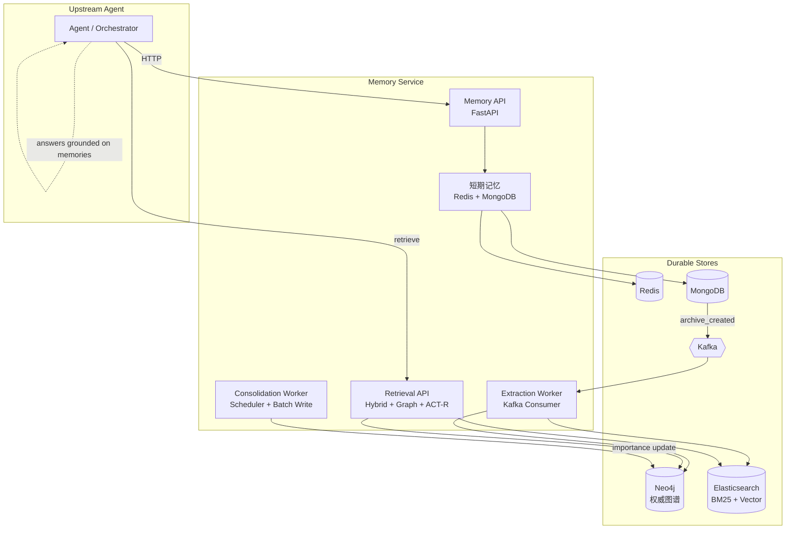
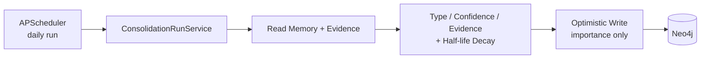

# 认知启发式 Agent 记忆系统

[](https://github.com/xu-jia-ming/memory_system/actions/workflows/ci.yml)


面向 Agent **跨会话长期记忆**的独立 Memory Service：围绕**萃取、检索、巩固与遗忘**构建完整记忆生命周期，在 [LoCoMo](https://github.com/snap-research/locomo) conv-30 评测子集（81 题）端到端 J-score 达 **62.6%**。

**技术栈**：Python 3.12 · FastAPI · Redis · MongoDB · Kafka · Neo4j · Elasticsearch · BGE-M3 · Docker Compose

---

## 架构总览



**巩固与遗忘（独立 Worker）**：



---

## 记忆生命周期

| 阶段 | 能力 | 关键实现 |
| --- | --- | --- |
| **存 · 压** | 活跃会话上下文与历史归档 | Redis 工作记忆 + MongoDB 不可变 `context_archive`；超阈值 LLM 融合压缩 |
| **抽 · 融** | 长期记忆形成 | Kafka 异步触发；LLM 结构化抽取；五态融合（CREATE / MERGE / SUPERSEDE / CONFLICT）；双写 Neo4j + ES |
| **检 · 活** | 高价值记忆召回 | BM25 + BGE-M3 并行召回 → RRF → Neo4j 一跳扩展 → ACT-R 多因子 Top-K |
| **巩 · 忘** | 权重动态演化 | 按类型 / 置信度 / 独立归档证据重算 `importance`；半衰期指数衰减软遗忘（不删数据） |

三个生产入口（同一镜像、不同 command）：

| 进程 | 命令 |
| --- | --- |
| `memory-api` | `python -m memory_system.entrypoints.api` |
| `memory-extraction-worker` | `python -m memory_system.entrypoints.extraction_worker` |
| `memory-consolidation-worker` | `python -m memory_system.entrypoints.consolidation_worker` |

---

## LoCoMo 评测结果（conv-30，81 题）

冻结配置下的端到端记忆问答评测（J-score 协议）。详细报告见 `data/locomo/`，复现脚本见 `scripts/locomo_eval/`。

| 维度 | 指标 | 说明 |
| --- | --- | --- |
| **端到端** | **J-score 62.6%** | 3 次复验：50 / 51 / 51（均值 50.7/81） |
| **记忆萃取** | 归档萃取成功率 **63.2% → 100%** | 7/19 归档经按条目定向修复后全通过 |
| **混合检索** | 检索难例并集召回 **75% → 100%** | 12 道排序失败样本；BM25 33.3% / 向量 75% / 并集 100% |
| **时间推理** | Temporal QA **57.7% → 73.1%** | 26 题（15/26 → 19/26）；确定性时间解析 + 问题相关证据筛选 |
| **记忆巩固** | 软遗忘机制 | 分类型半衰期；长期权重不依赖 `retrieval_count`，避免正反馈 |

---

## 核心设计亮点

- **独立 Memory Service**：上游 Agent 仅通过 HTTP API 访问，无需感知 Redis / Kafka / 图谱等底层存储。
- **异步解耦萃取**：归档事件经 Kafka 驱动，LLM 抽取不阻塞对话路径；幂等 + 定向修复保障归档链路可靠。
- **混合检索 + 图谱扩展**：关键词与语义双路召回，RRF 融合后 Neo4j 一跳补全关联记忆，ACT-R 近似激活完成最终排序。
- **软遗忘而非硬删除**：巩固只更新 `importance`；`superseded` / 长期未活跃记忆权重衰减，历史仍可 `include_history` 召回。
- **工程化交付**：GitHub Actions（Ruff · Mypy · Unit/Contract · Integration）；`domain` + `application` **≥ 80%** 覆盖率门禁；全链路 E2E 与 failure injection（PR #59）。

---

## 5 分钟快速开始

**前置**：Linux、Docker、 [uv](https://github.com/astral-sh/uv)、可复制 `.env.example` → `.env` 并填入 LLM / API Key。

```bash
git clone https://github.com/xu-jia-ming/memory_system.git
cd memory_system
uv sync --locked
cp .env.example .env   # 编辑 LLM__API_KEY 等

# 启动基础设施 + Embedding + 迁移 + 三个应用容器
bash scripts/preflight/check_linux_host.sh --mode=auto
./scripts/lock_tei_images.sh --update
./scripts/compose.sh --embedding=none pull && ./scripts/compose.sh --embedding=none build
./scripts/compose.sh --embedding=none up -d redis mongodb kafka neo4j elasticsearch
./scripts/start_embedding.sh auto
./scripts/compose.sh --embedding=current run --rm init-infra
./scripts/compose.sh --embedding=current up -d \
  memory-api memory-extraction-worker memory-consolidation-worker
```

验证：

```bash
curl -s http://localhost:8000/health/ready | jq .
# 期望 status: ready
```

本地开发 quality gate：

```bash
bash scripts/ci/run_merge_gate.sh
```

完整部署、Embedding 模式、回滚与运维见 **[docs/deployment.md](docs/deployment.md)** 与 **[docs/operations.md](docs/operations.md)**。

---

## 文档

| 文档 | 说明 |
| --- | --- |
| [docs/README.md](docs/README.md) | 文档索引 |
| [docs/deployment.md](docs/deployment.md) | Compose 标准启动、Embedding、环境变量 |
| [docs/operations.md](docs/operations.md) | TEI 内存契约、Preflight、CI、回滚、运维手册 |
| [01_技术规格/记忆系统设计文档_全链路MVP技术选型版(9).md](01_技术规格/记忆系统设计文档_全链路MVP技术选型版(9).md) | 权威技术规格 |
| [docs/development/](docs/development/) | 贡献者与 AI 辅助开发流程（非面试必读） |

---

## 项目状态

**MVP 已交付**（`v0.9.0-mvp-rc1` 验收基线）：Memory API、Extraction Worker、Consolidation Worker、混合检索与巩固链路均已实现并通过集成 / E2E 测试。

| 组件 | 状态 |
| --- | --- |
| Memory API（会话 / 检索 / 管理） | ✅ 生产入口可用 |
| Extraction Worker（Kafka → LLM → Neo4j/ES） | ✅ 生产 pipeline 已接线 |
| Consolidation Worker（调度 / 批处理 / 乐观锁写入） | ✅ 含 mutex 与 graceful shutdown |
| Hybrid Retrieval（BM25 + Vector + RRF + Graph + ACT-R） | ✅ |
| Docker Compose 全栈 + Migration Runner | ✅ |
| LoCoMo conv-30 评测与脚本 | ✅ `scripts/locomo_eval/` |

---

## License

[MIT License](LICENSE)
